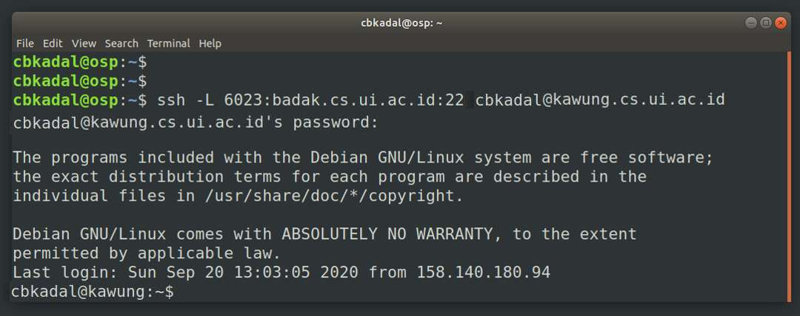
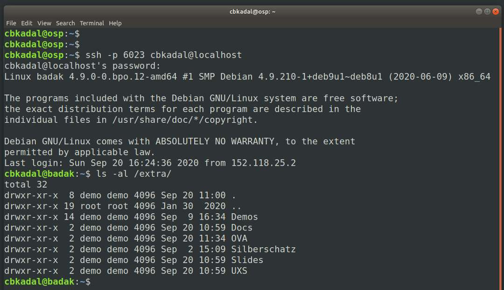
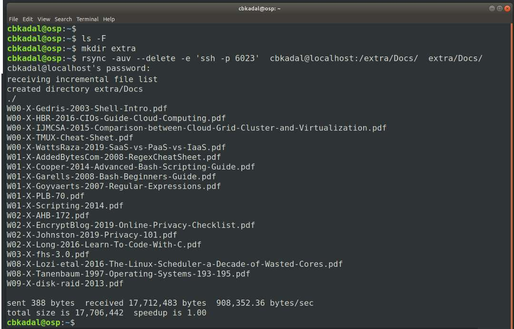
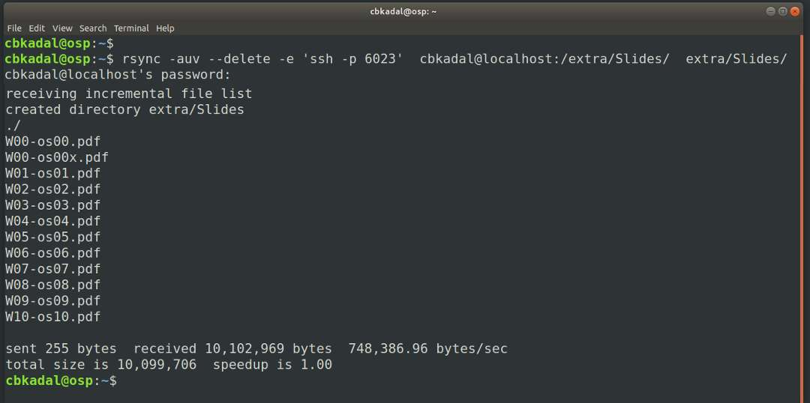
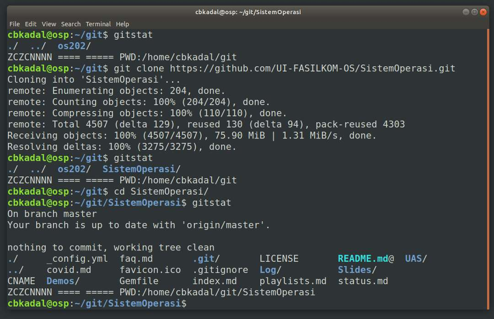

---
---
[HOME](index.md)
[ABOUT](README.md)
[WEB](https://osp4diss.vlsm.org/)
[GITHUB](https://github.com/UI-FASILKOM-OS/osp4diss/)
[TOP](#)
[BOTTOM](#endofpage)
[PREV](MoreGNULinux.md)
[NEXT](CBKadal2.md)

# Eg. User: cbkadal

These following examples is for user **cbkadal** of guest *osp*.
Replace **cbkadal** with your own user name.

<br>
## Set a tunnel from osp (port 6023) to badak (ssh port 22) via kawung.

```
ssh -L 6023:badak.cs.ui.ac.id:22 cbkadal@kawung.cs.ui.ac.id
```



<br>
## Connect to badak via a tunnel.

```
ssh -p 6023 cbkadal@localhost
ls -al /extra/
```


<br>
## Copy from badak:///extra/ to *osp* via tunnel

```
ls -F
mkdir extra
rsync -auv --delete -e 'ssh -p 6023' cbkadal@localhost:/extra/Docs/  extra/Docs/
```



<br>
```
rsync -auv --delete -e 'ssh -p 6023' cbkadal@localhost:/extra/Slides/  extra/Slides/
```



<br>
## Setup git

Config name and email for git.
Replace 'Cicak Bin Kadal' with your own name.

```
gitstat
git config --global user.email        'cbkadal@DELETE.vlsm.org'
git config --global user.name         'Cicak Bin Kadal'
git config --global core.editor       'vi'
git config --global credential.helper 'cache --timeout=3600'
git config user.email
git config user.name
git config core.editor
git config credential.helper
git config --list
cat ~/.gitconfig
gitstat
```
<br>


<br>
## Cloning a github repository "os202"


<br>
```
cd
gitstat
mkdir git
cd git
git clone https://github.com/cbkadal/os202.git
gitstat
cd git
gitstat
```


<br>
## Cloning a github repository "SistemOperasi"


<br>
```
cd 
cd git
gitstat
git clone https://github.com/UI-FASILKOM-OS/SistemOperasi.git
gitstat
cd SistemOperasi
gitstat
```



<br>
## Updating mylog.txt

```
cd
gitstat
cd git/os202/TXT
gitstat
vi mylog.txt
```


<br>
## mylog.txt


```
gitstat
git add -A
gitstat
```


```
git commit -m "OS202 cbkadal UPDATE mylog.txt"
gitstat
git pull
git push
git stat
```


<br>
#### ENDOFPAGE
[HOME](index.md)
[ABOUT](README.md)
[WEB](https://osp4diss.vlsm.org/)
[GITHUB](https://github.com/UI-FASILKOM-OS/osp4diss/)
[TOP](#)
[BOTTOM](#endofpage)
[PREV](MoreGNULinux.md)
[NEXT](CBKadal2.md)

