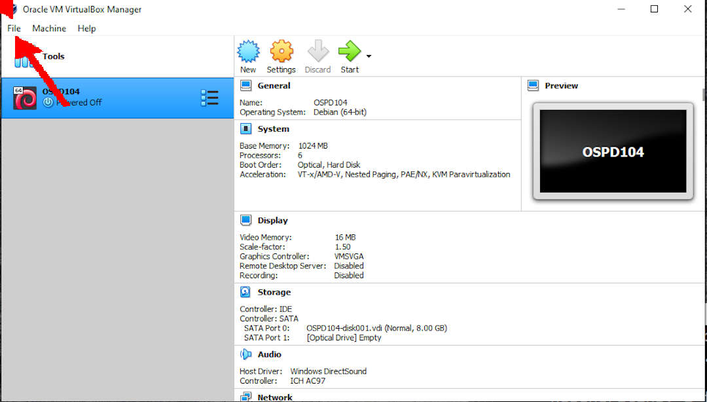
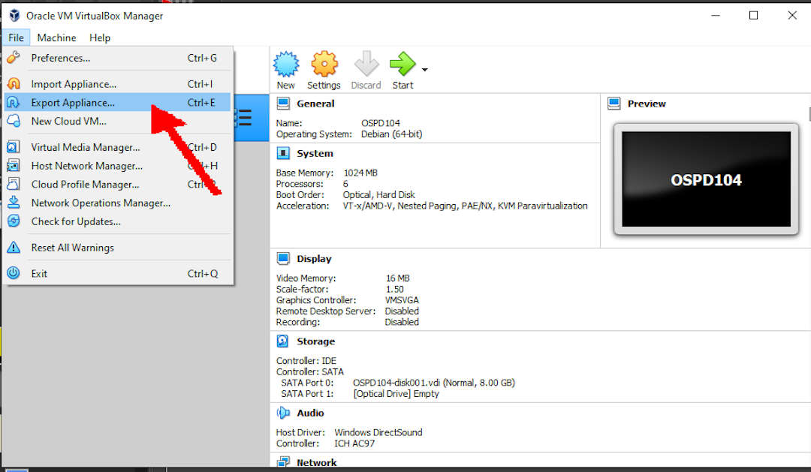
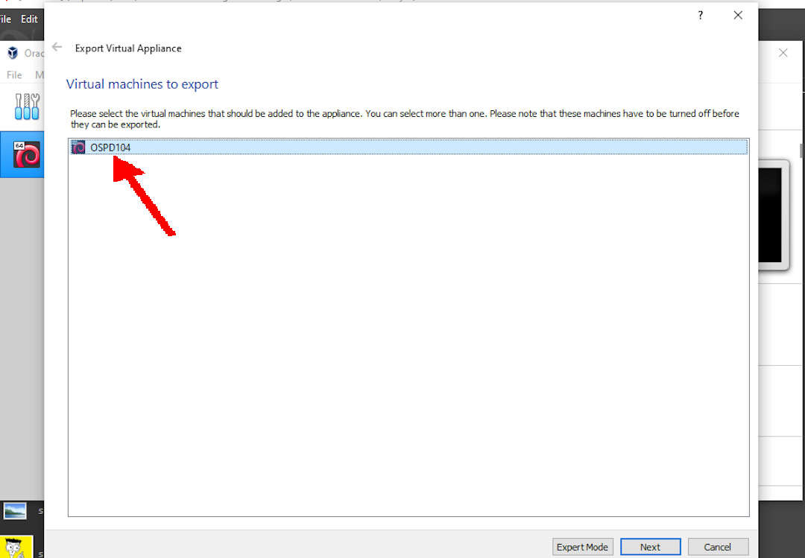
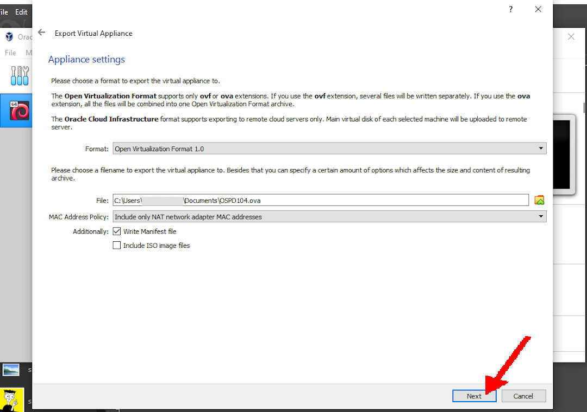
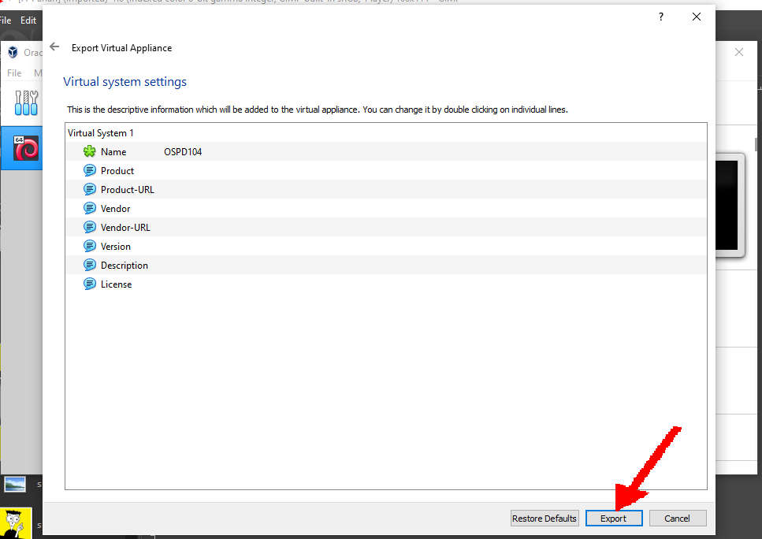

---
---

[HOME](index.md)
[ABOUT](README.md)
[WEB](https://osp4diss.vlsm.org/)
[GITHUB](https://github.com/UI-FASILKOM-OS/osp4diss/)
[TOP](#)
[BOTTOM](#endofpage)
[PREV](DebianGuestOnVirtualBox.md)
[NEXT](DebianGuestImportOva.md)

# Exporting a Debian Guest In OVA Format

 
# DONE!

 
#### ENDOFPAGE
[HOME](index.md)
[ABOUT](README.md)
[WEB](https://osp4diss.vlsm.org/)
[GITHUB](https://github.com/UI-FASILKOM-OS/osp4diss/)
[TOP](#)
[BOTTOM](#endofpage)
[PREV](DebianGuestOnVirtualBox.md)
[NEXT](DebianGuestImportOva.md)
 

