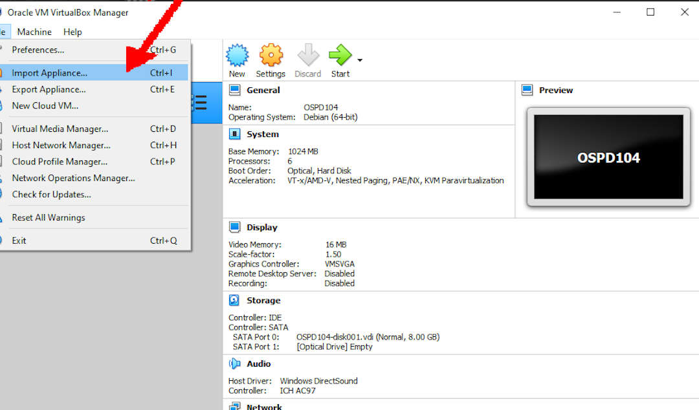
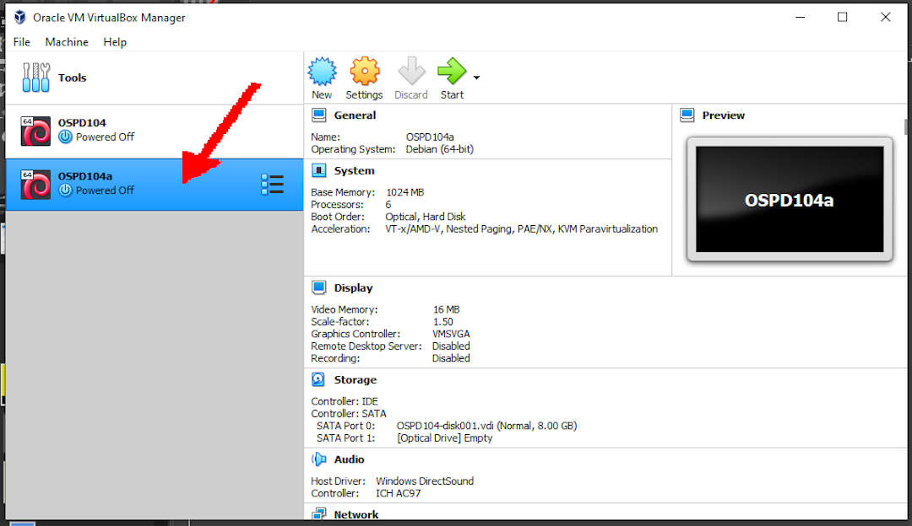

---
---

[HOME](index.md)
[ABOUT](README.md)
[WEB](https://osp4diss.vlsm.org/)
[GITHUB](https://github.com/UI-FASILKOM-OS/osp4diss/)
[TOP](#)
[BOTTOM](#endofpage)
[PREV](index.md)
[NEXT](index.md)

# Importing a Debian Guest In OVA Format

You might want to keep **OSPD104** as a backup, and using **OSPD104a** for daily usage.

 
## New Name: "OSPD104a"

 
# DONE!

 
#### ENDOFPAGE
[HOME](index.md)
[ABOUT](README.md)
[WEB](https://osp4diss.vlsm.org/)
[GITHUB](https://github.com/UI-FASILKOM-OS/osp4diss/)
[TOP](#)
[BOTTOM](#endofpage)
[PREV](index.md)
[NEXT](index.md)
 

