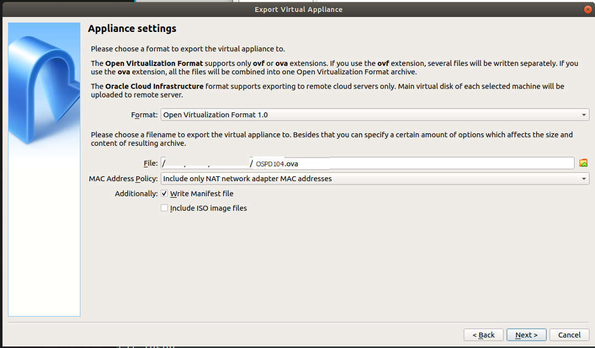
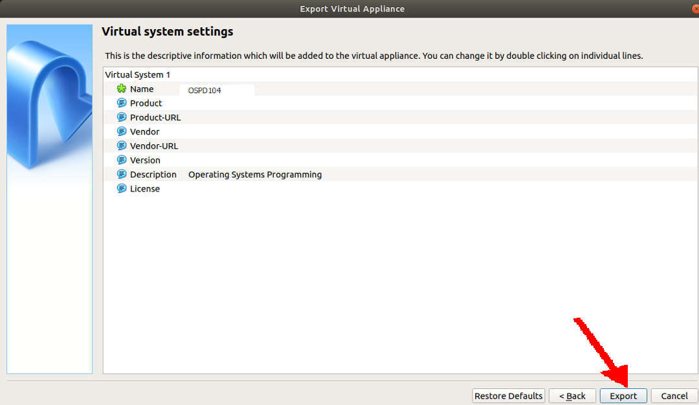

---
---

[HOME](index.md)
[ABOUT](README.md)
[WEB](https://osp4diss.vlsm.org/)
[GITHUB](https://github.com/UI-FASILKOM-OS/osp4diss/)

# Creating a Debian Guest on VirtualBox

 
## URLs

* [Free Download Manager](https://www.freedownloadmanager.org/)

* [Debian CD Image](https://cdimage.debian.org/debian-cd/current/amd64/iso-cd/)

* [Virtual Box](https://www.virtualbox.org/wiki/Downloads)

 
## Downloading Free Download Manager (FDM)

 
## Downloading debian-10.4.0-amd64-netinst.iso using FDM

 
## Installing VirtualBox

 
## Adding VirtualBox Extension

 
## Creating A Debian Guest

* You should adjust these following according to your own belief and faith.
  * **OSPD104** = Operating System Programming with Debian 10.4
  * Memory = 1 GB
  * Storage = 8 GB (dynamically allocated)
  * NAT from host (127.0.0.1 port 6022) to guest (10.0.2.15 port 22)

 

 

