---
---

[HOME](index.md)
[ABOUT](README.md)
[WEB](https://osp4diss.vlsm.org/)
[GITHUB](https://github.com/UI-FASILKOM-OS/osp4diss/)
[TOP](#)
[BOTTOM](#endofpage)
[PREV](index.md)
[NEXT](index.md)

# Creating a Debian Guest on VirtualBox

 
## Part 1: Creating a New Guest

* You should adjust these following according to your own belief and faith.
  * **OSPD104** = Operating System Programming with Debian 10.4
  * Memory = 1024 MB
  * Storage = 8 GB (dynamically allocated)
  * NAT from host (127.0.0.1 port 6022) to guest (10.0.2.15 port 22)

 

 
* **OSPD104** = Operating System Programming with Debian 10.4

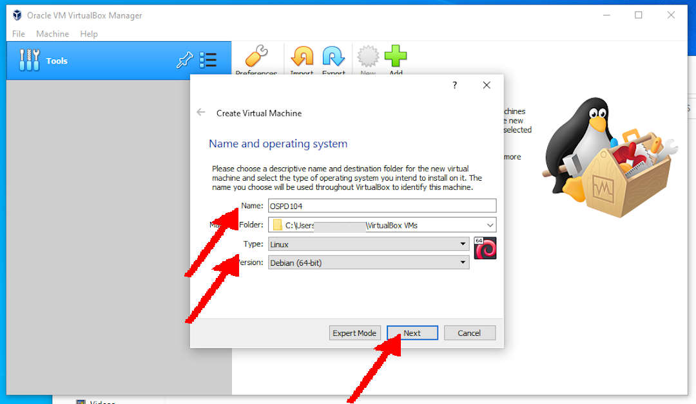

 
* Memory = 1024 MB

 
* Storage = 8 GB (dynamically allocated)

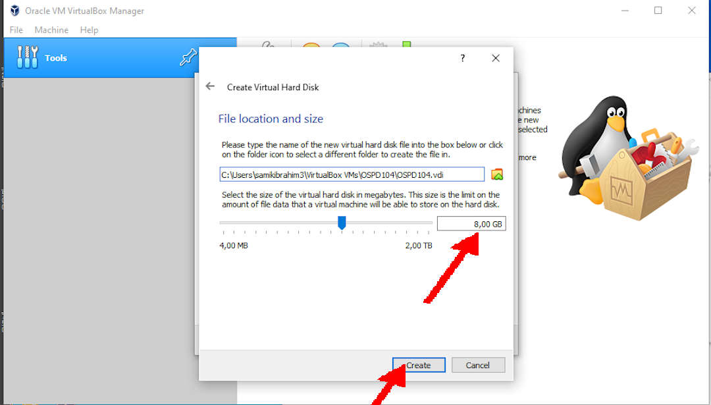

 
## Part 2: Setting the New Guest

 
### General: Basic

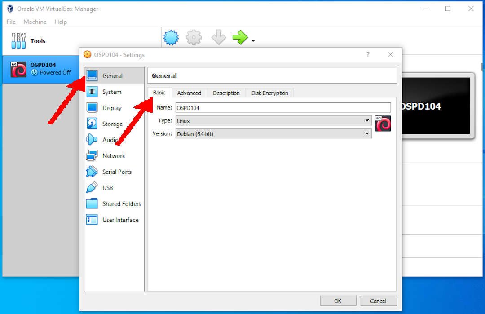

 
### General: Advanced

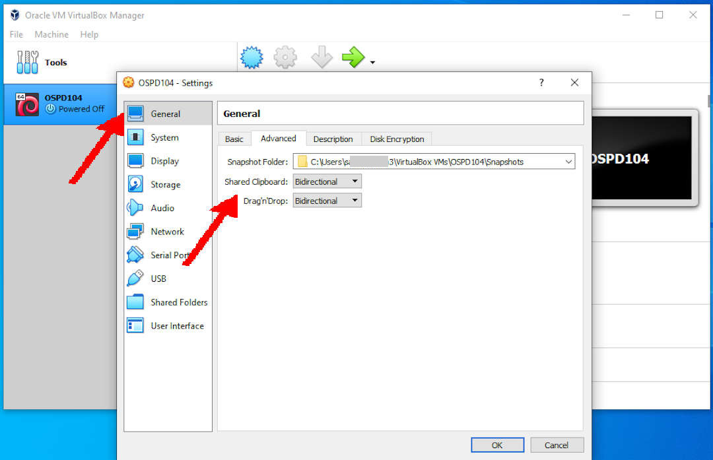

 
### System: Motherboard

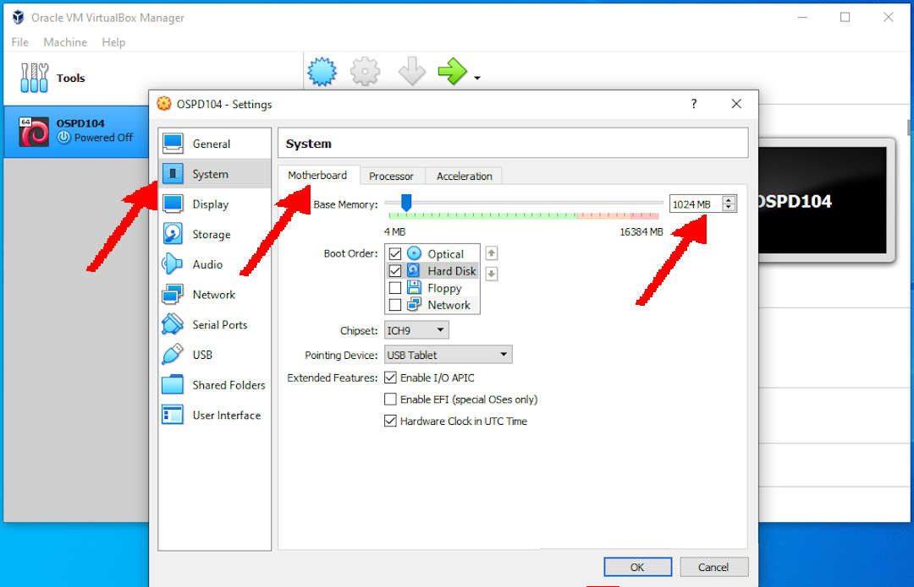

 
### System: Processor

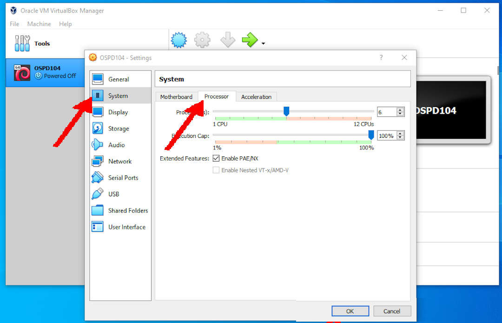

 
### System: Acceleration

 
### Display: Screen

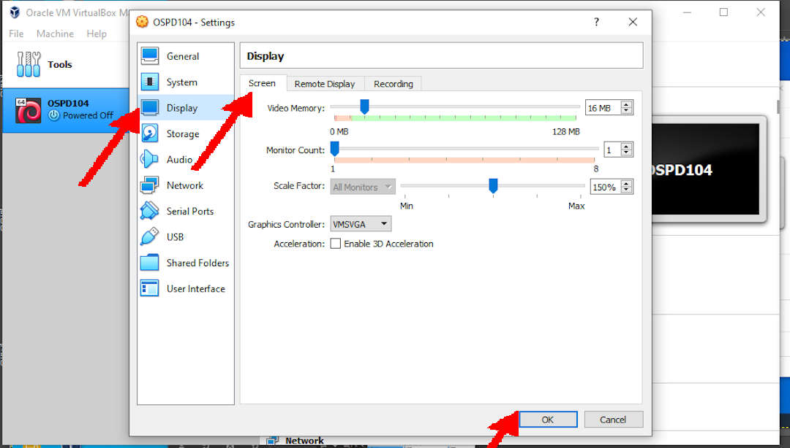

 
### Storage: SATA

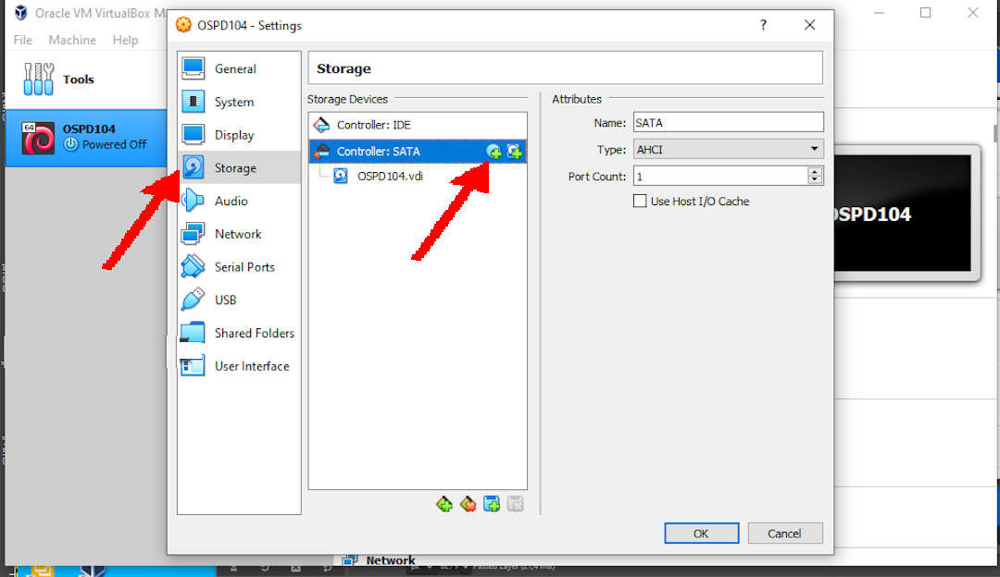

 
### Storage: SATA: Add Debian NetInst ISO image

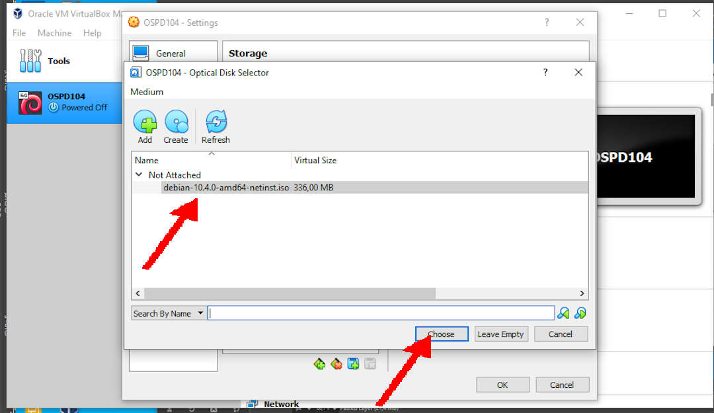

 
### Network: Adapter 1 (NAT): Port Forwarding

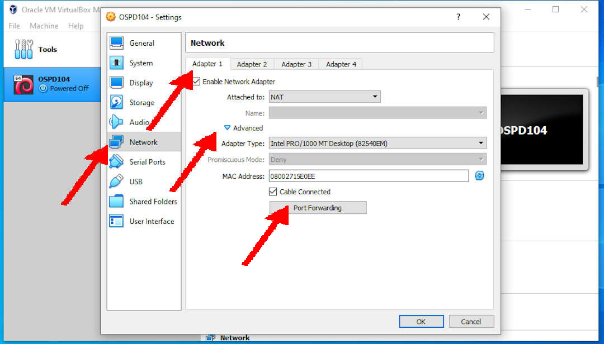

 
### Network: Adapter 1 (NAT)

* Forward ssh from host 127.0.0.1:6022 to guest 10.0.2.15:22

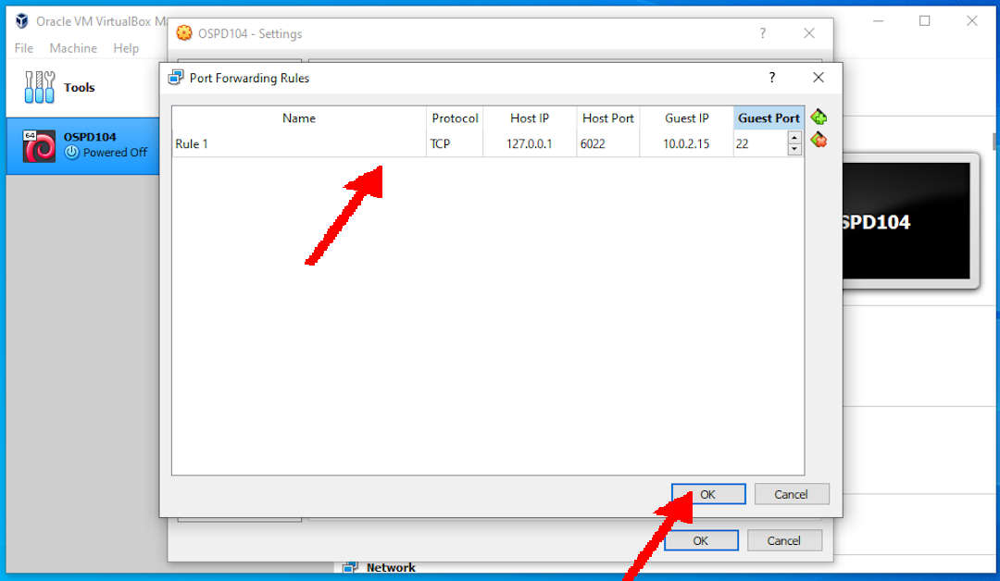

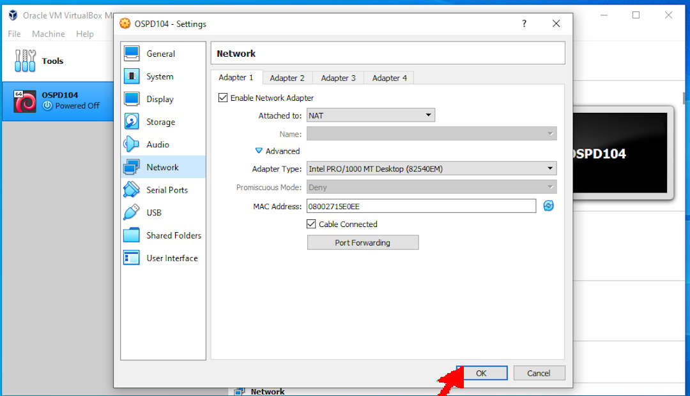

 
## DONE!

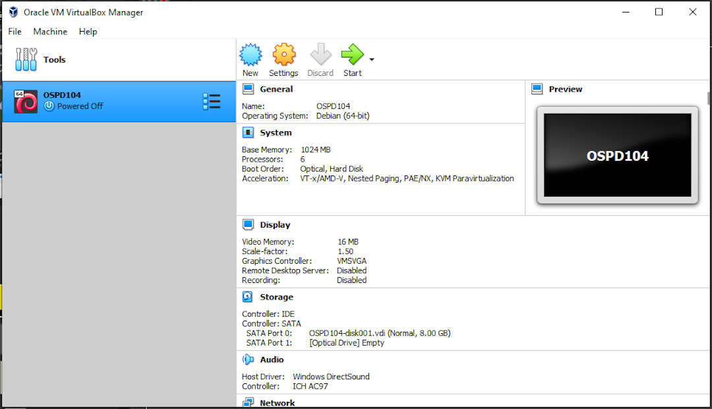

 
#### ENDOFPAGE
[HOME](index.md)
[ABOUT](README.md)
[WEB](https://osp4diss.vlsm.org/)
[GITHUB](https://github.com/UI-FASILKOM-OS/osp4diss/)
[TOP](#)
[BOTTOM](#endofpage)
[PREV](index.md)
[NEXT](index.md)
 

