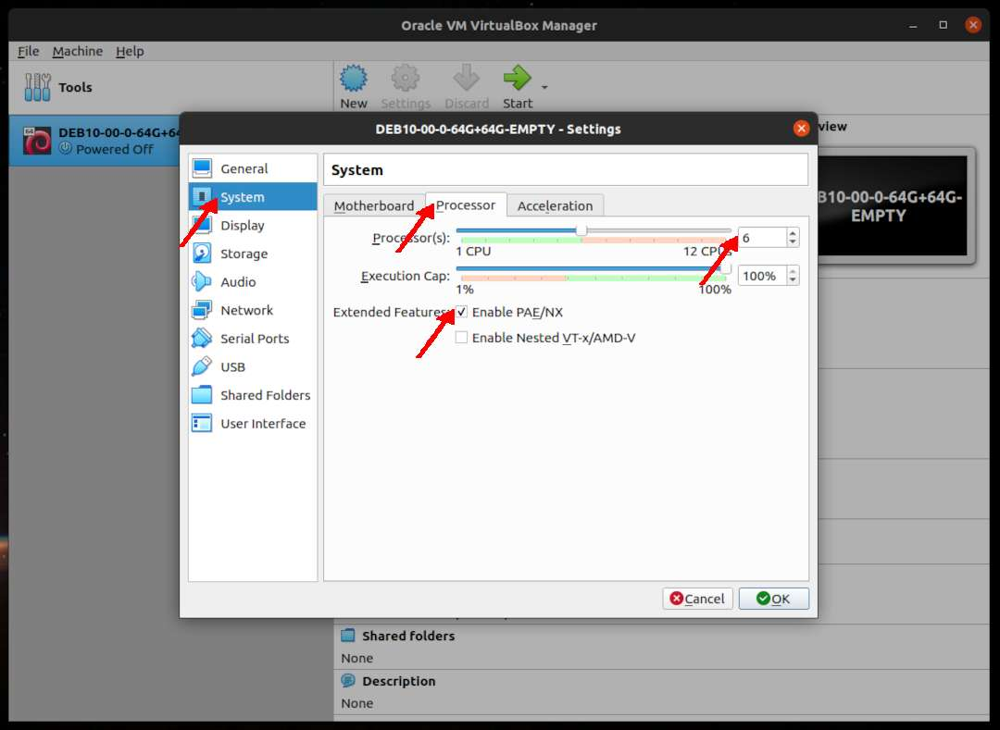

---
---

[HOME](index.md)
[ABOUT](README.md)
[WEB](https://osp4diss.vlsm.org/)
[GITHUB](https://github.com/UI-FASILKOM-OS/osp4diss/)
[TOP](#)
[BOTTOM](#endofpage)
[PREV](DebianGuestOnVirtualBox2.md)
[NEXT](DebianGuestOnVirtualBox4.md)

# New VirtualBox Guest: System

* Example **DEB10-00-0-64G+64G-EMPTY**

### Click SETTING

 
### System: Motherboard

 
### System: Processors (6)

* How many cores are available?

 
### System: Acceleration

  

[HOME](index.md)
[ABOUT](README.md)
[WEB](https://osp4diss.vlsm.org/)
[GITHUB](https://github.com/UI-FASILKOM-OS/osp4diss/)
[TOP](#)
[BOTTOM](#endofpage)
[PREV](DebianGuestOnVirtualBox2.md)
[NEXT](DebianGuestOnVirtualBox4.md)

