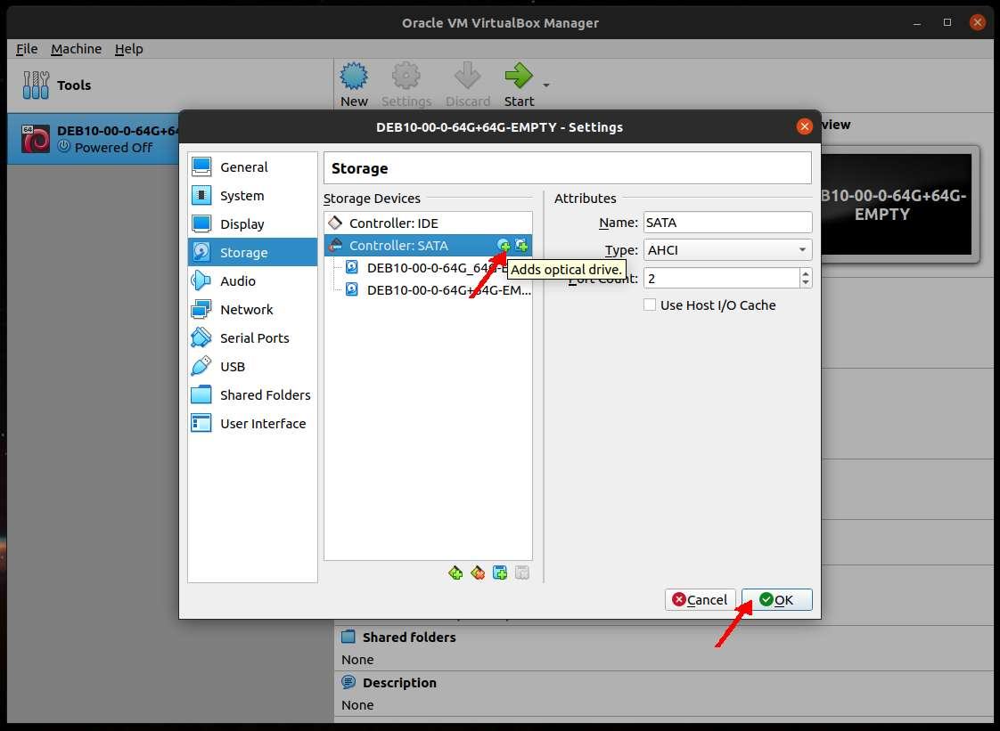
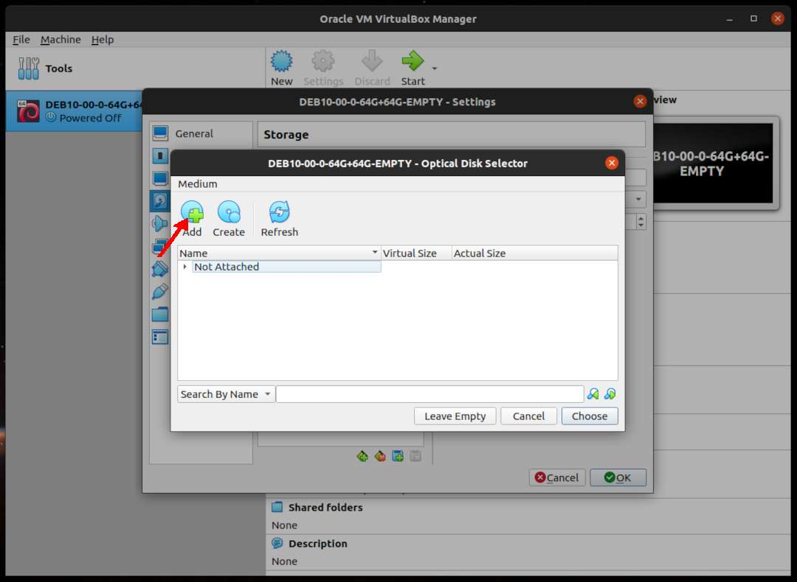
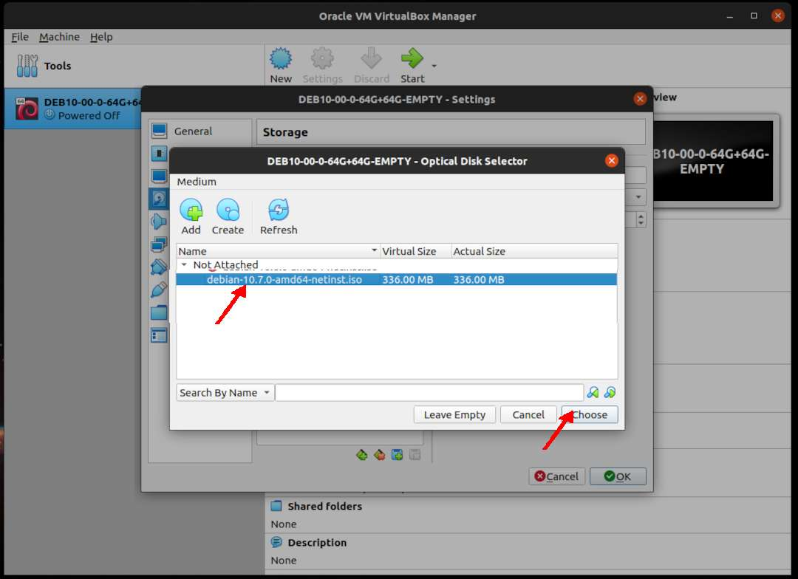
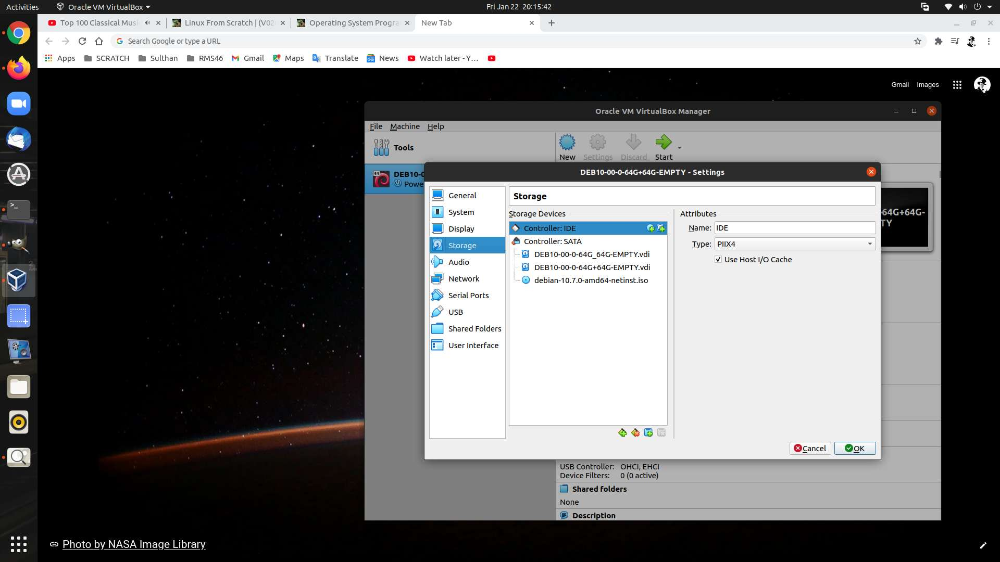
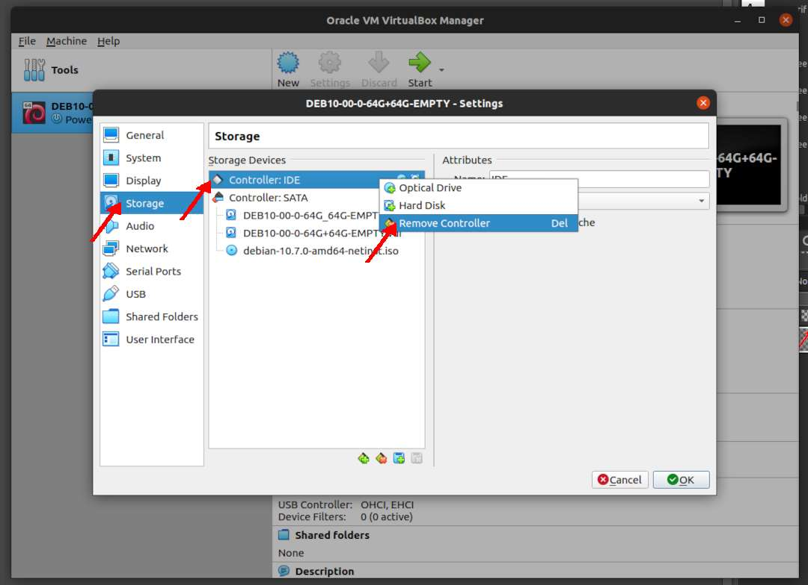
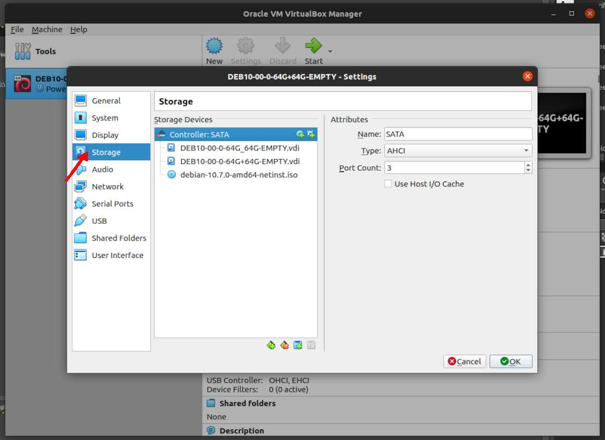

---
---

[HOME](index.md)
[ABOUT](README.md)
[WEB](https://osp4diss.vlsm.org/)
[GITHUB](https://github.com/UI-FASILKOM-OS/osp4diss/)
[TOP](#)
[BOTTOM](#endofpage)
[PREV](DebianGuestOnVirtualBox4.md)
[NEXT](DebianGuestOnVirtualBox6.md)

# New VirtualBox Guest: Audio

* Example **DEB10-00-0-64G+64G-EMPTY**

### Click SETTING

 
### Storage: Remove Empty IDE

* RIGHT click (Remove Attachment)

* Remove Empty 

 
### Storage: SATA: Adds Hard disk

* Create a new disk

* Hard disk type: VDI

* Dynamically Allocated

* (Second) Disk Storage: 64 GB

* Choose (64 GB Storage)

* Sellect IDE Controller

* Remove IDE Controller

 
### Audio

* (Nothing)

 
### Network: Adapter 1 (NAT): Port Forwarding

* Click Port Forwarding

* **ADD (+)** Forward ssh from host 127.0.0.1:6022 to guest 10.0.2.15:22 (SSH)

* **ADD (+)** Forward ssh from host 127.0.0.1:5000 to guest 10.0.2.15:4000 (Jekyll)

 
### Network: Adapter 1 (NAT) --- DONE

 
## DEB10-00-0-64G+64G-EMPTY is DONE!

 
#### ENDOFPAGE
[HOME](index.md)
[ABOUT](README.md)
[WEB](https://osp4diss.vlsm.org/)
[GITHUB](https://github.com/UI-FASILKOM-OS/osp4diss/)
[TOP](#)
[BOTTOM](#endofpage)
[PREV](DebianGuestOnVirtualBox4.md)
[NEXT](DebianGuestOnVirtualBox6.md)

