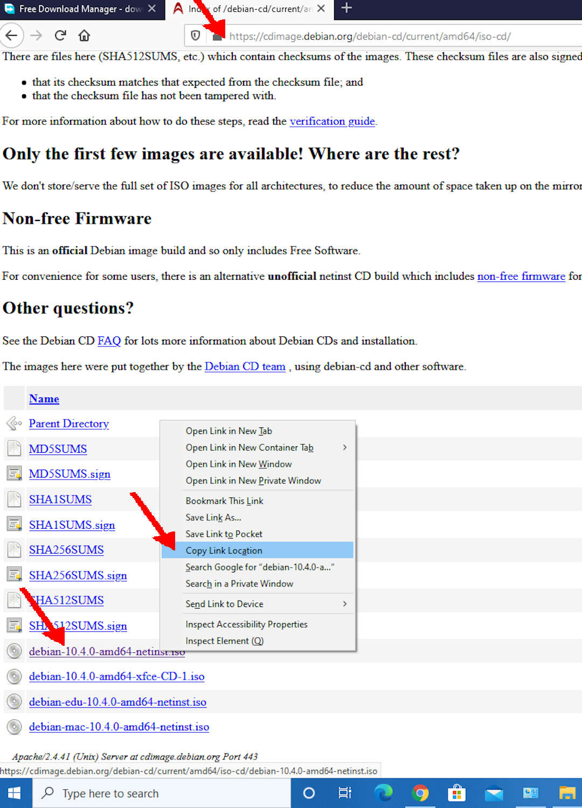
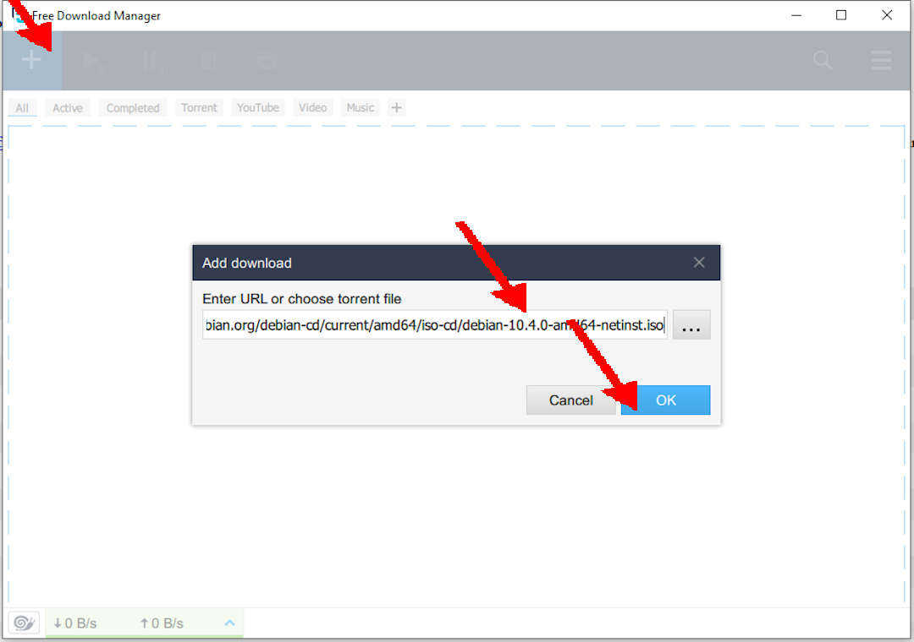
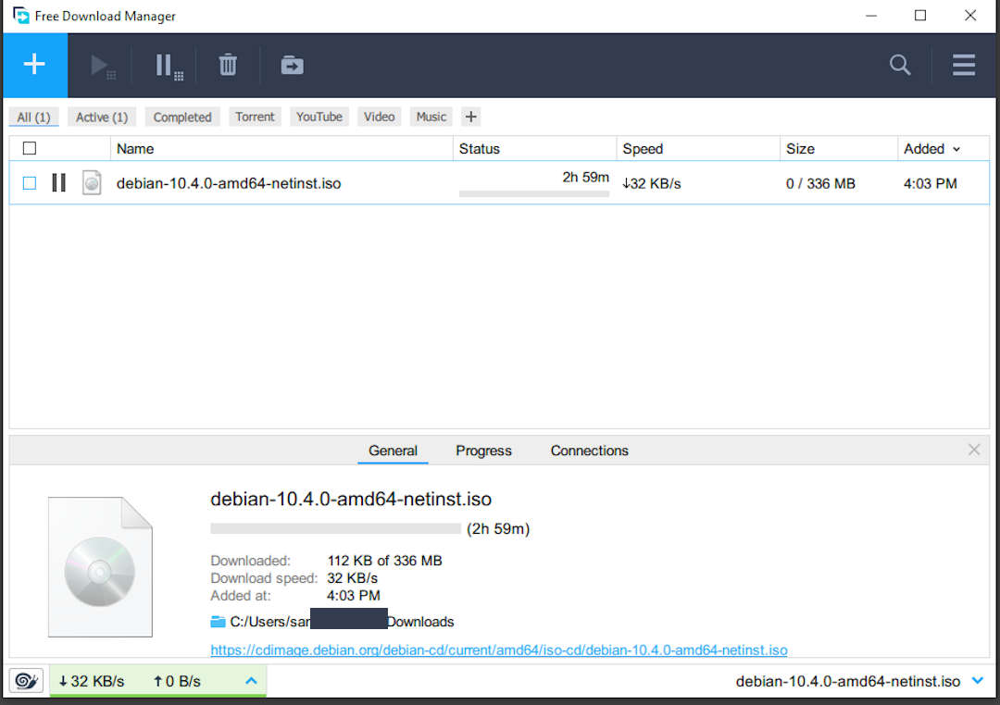
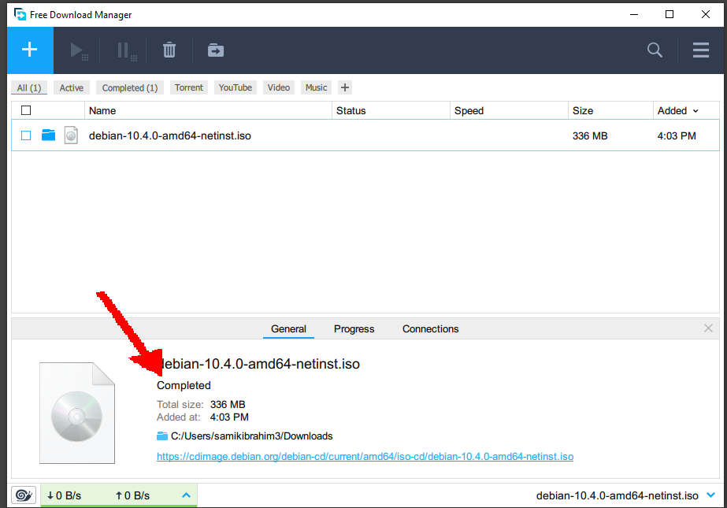

---
---

[INDEX](index.md)
[README](README.md)
[WEB](https://osp4diss.vlsm.org/)
[GITHUB](https://github.com/UI-FASILKOM-OS/osp4diss/)

# Downloading Debian Netinst with Free Download Manager

 
## URL: [https://cdimage.debian.org/debian-cd/current/amd64/iso-cd/](https://cdimage.debian.org/debian-cd/current/amd64/iso-cd/)

### debian-10.4.0-amd64-netinst.iso

 
## Runing Free Download Manager

 
## Download: [https://cdimage.debian.org/debian-cd/current/amd64/iso-cd/debian-10.4.0-amd64-netinst.iso](https://cdimage.debian.org/debian-cd/current/amd64/iso-cd/debian-10.4.0-amd64-netinst.iso)

 
## DONE!
