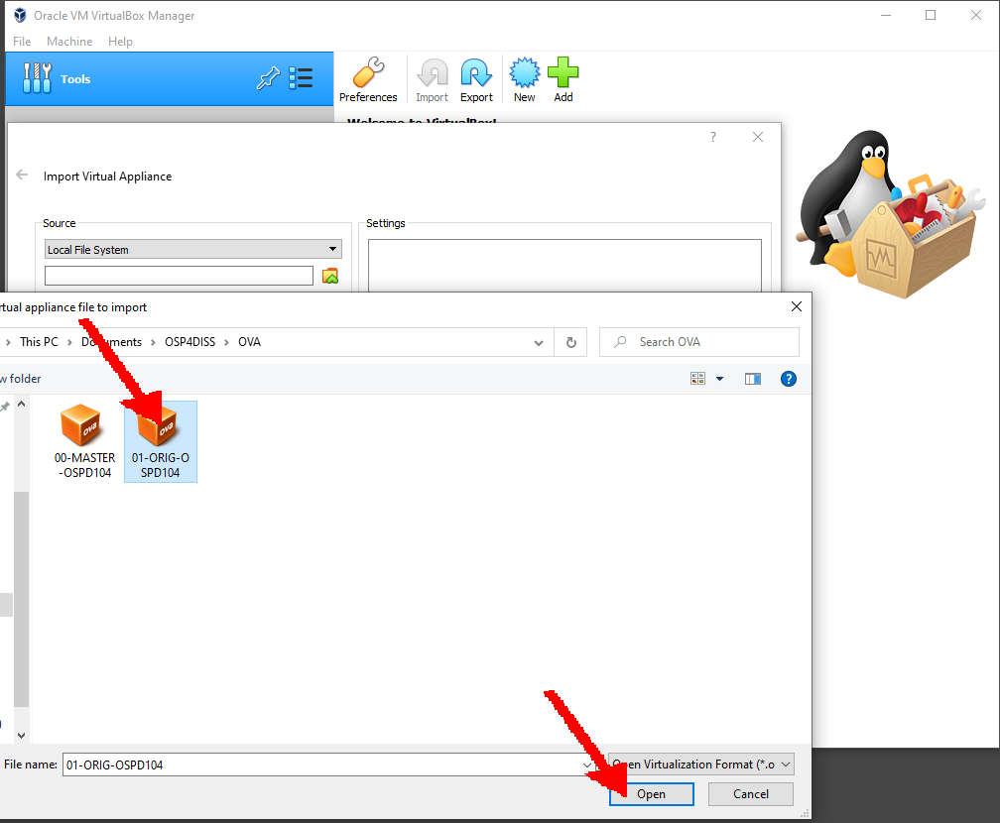
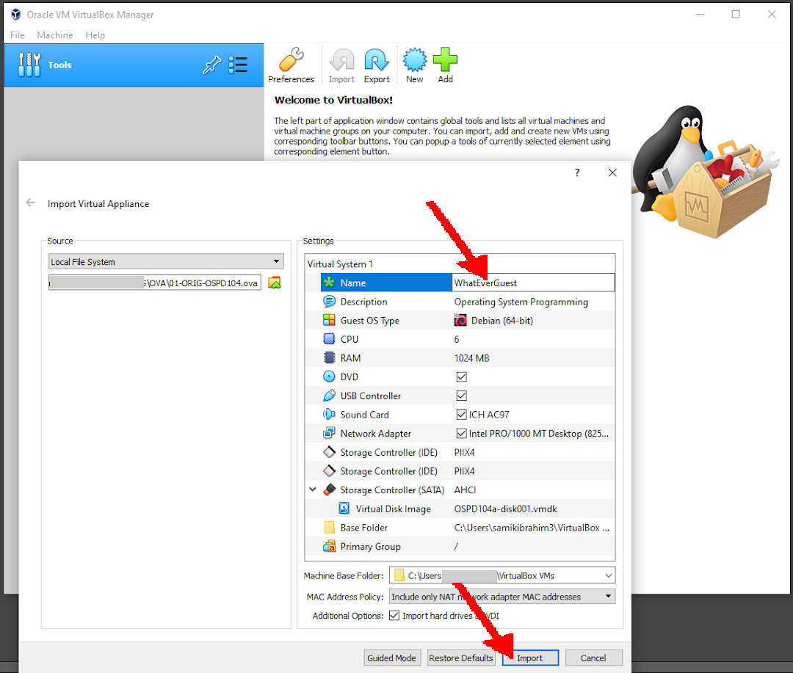
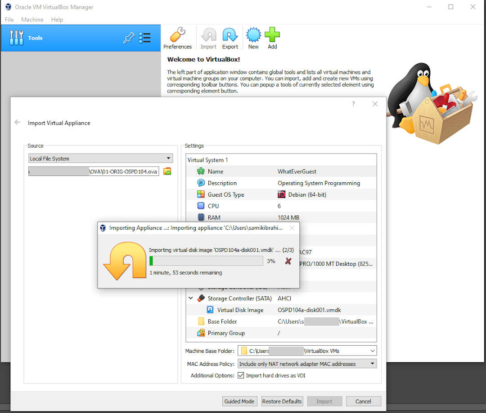

---
---

[HOME](index.md)
[ABOUT](README.md)
[WEB](https://osp4diss.vlsm.org/)
[GITHUB](https://github.com/UI-FASILKOM-OS/osp4diss/)
[TOP](#)
[BOTTOM](#endofpage)
[PREV](InstallDebianNetinst.md)
[NEXT](SSHGuest.md)

# More About Export Import Guests

## Delete OLD-GUEST

* Select OLD-GUEST

* Select Remove

* Select Delete All Files

## Importing a GUEST

* Select File/Import Applience...

* Locate and select an OVA file

* Open the OVA file

* Rename guest to "WhatEverGuest"

* Import

* Guest "WhatEverGuest" is ready.

 
# DONE

 
# The SHORTCUT

For a limited time only!
If you are rushing, you might want to download this following OVA file.
No purchase necessary and void where prohibited.
Hurry, Google might not like it if too many downloads a huge file.

* **README**:  [https://bit.ly/3mxkpvP](https://bit.ly/3mxkpvP) (182 bytes)

* **Debian 10.5 OVA for VirtualBox**: [https://bit.ly/2FMU7F8](https://bit.ly/2FMU7F8) (662MB)

* **README2**: [https://bit.ly/30ysAP5](https://bit.ly/30ysAP5) (249 bytes)

* **Ubuntu Server 20.04 for VirtualBox**: [https://bit.ly/2HRIihL](https://bit.ly/2HRIihL) (1.2GB)

 
#### ENDOFPAGE
[HOME](index.md)
[ABOUT](README.md)
[WEB](https://osp4diss.vlsm.org/)
[GITHUB](https://github.com/UI-FASILKOM-OS/osp4diss/)
[TOP](#)
[BOTTOM](#endofpage)
[PREV](InstallDebianNetinst.md)
[NEXT](SSHGuest.md)
 
