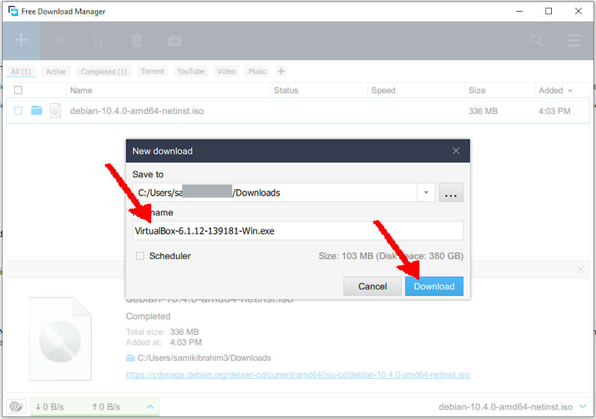
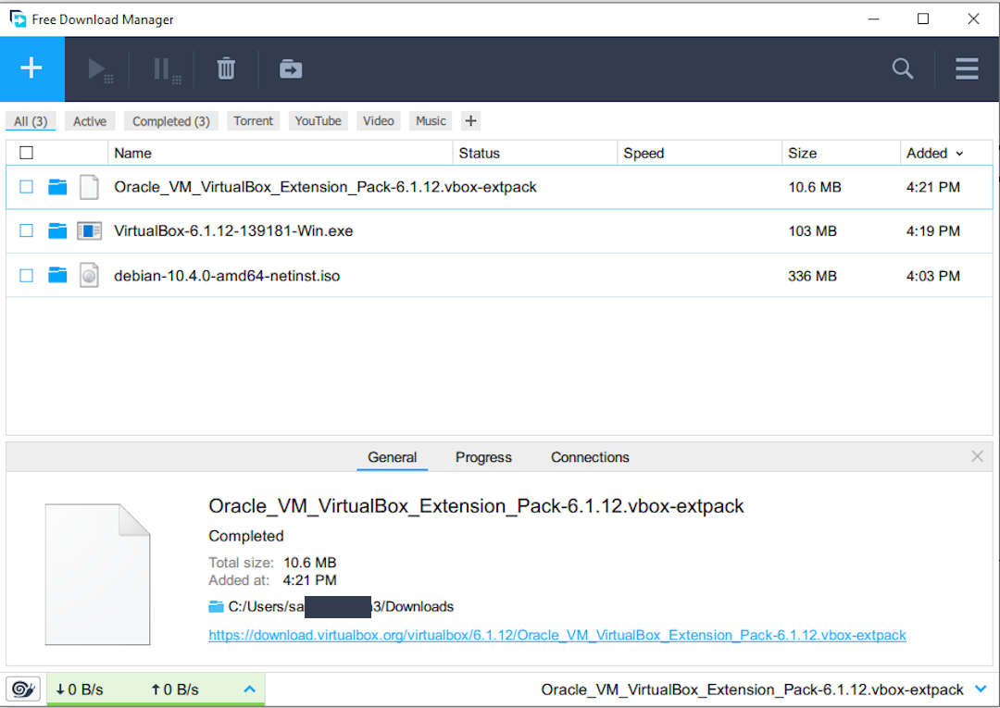

---
---

[HOME](index.md)
[ABOUT](README.md)
[WEB](https://osp4diss.vlsm.org/)
[GITHUB](https://github.com/UI-FASILKOM-OS/osp4diss/)
[TOP](#)
[BOTTOM](#endofpage)
[PREV](DebianISOImage.md)
[NEXT](DebianGuestOnVirtualBox.md)

# Downloading and Installing VirtualBox

## NOTE: The current VirtualBox version is 6.1.18
### (The VirtualBox version in this example is 6.1.12)

## THIS IS SUBJECT TO CHANGE!

## URL: [VirtualBox.org](https://www.virtualbox.org/wiki/Downloads)

 

 
## The Free Download Manager (FDM)

Use this Free Download Manager if your internet link is slow and less reliable.
Otherwise, download with a regular browser like Firefox.

 
## Installing VirtualBox on Windows 10

 
## Adding VirtualBox Extension

Just **CLICK** the Extension package!

 
## Your VirtualBox version

 
## The VirtualBox and its Extension Pack are ready!

 
## Intel (VMX) Virtualization Technology

To use VirtualBox, **VMX** has to be enabled.
Check your PC (BIOS) configuration.
"VMX" stands for Virtual Machine Extensions. 

 
**DISABLED**

 
**ENABLED**

 
#### ENDOFPAGE
[HOME](index.md)
[ABOUT](README.md)
[WEB](https://osp4diss.vlsm.org/)
[GITHUB](https://github.com/UI-FASILKOM-OS/osp4diss/)
[TOP](#)
[BOTTOM](#endofpage)
[PREV](DebianISOImage.md)
[NEXT](DebianGuestOnVirtualBox.md)
 

