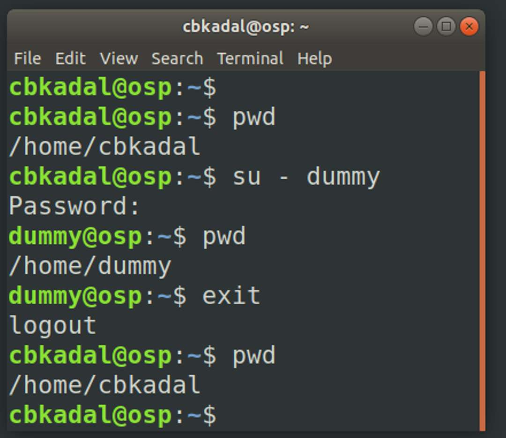
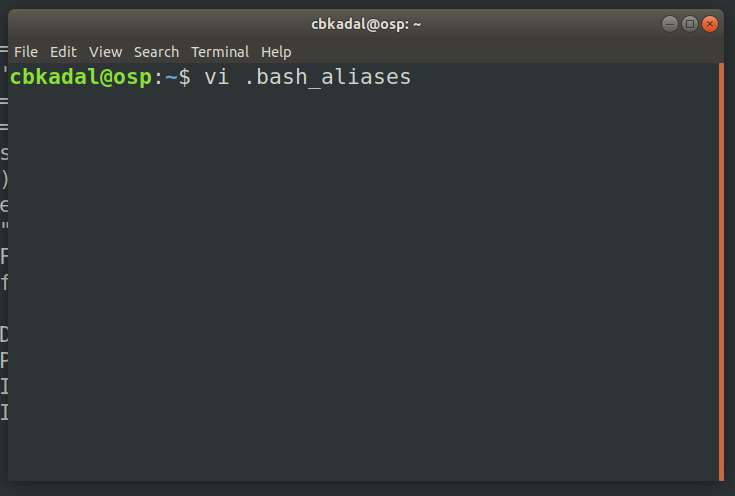

---
---

[HOME](index.md)
[ABOUT](README.md)
[WEB](https://osp4diss.vlsm.org/)
[GITHUB](https://github.com/UI-FASILKOM-OS/osp4diss/)
[TOP](#)
[BOTTOM](#endofpage)
[PREV](Welcome2GNULinux.md)
[NEXT](index.md)

# More Gnu/Linux

<span style="color:red; font-weight:bold; font-size:larger;">
You need an editor for this page. Preferable, the vi (visual) editor.
</span>


<br>
## Substitute User/su (default root)
```
su -
```
<br>
## Add (a) user dummy
```
adduser dummy
```
<br>

<br>
<br>
## Substitute user dummy
```
pwd
su - dummy
```
### Testing home directory user dummy
```
pwd
exit
```

<br>
<br>
## Create/Edit your first file: ".bash_aliases"
* Use your favorite editor (vi) to add this following to the file (.bash_aliases).

```
alias cl='clear'
alias h='history'  
alias mv='mv -i'  
alias rm='rm -i'  
alias sss='. ~/.profile'
gitstat() {
   git rev-parse --is-inside-work-tree &> /dev/null
   [ "$?" == "0" ] && git status
   ls -aF
   printf "ZCZCNNNN ==== ===== PWD:%s\n" $(pwd)
}
export EDITOR=/usr/bin/vi
export GPG_TTY=/dev/tty
export HISTSIZE=2000
export HISTFILESIZE=2000 
```
<br>
<br>
## Testing ".bash_aliases"
```
h
source ~/.profile
h
```





<br>
#### ENDOFPAGE
[HOME](index.md)
[ABOUT](README.md)
[WEB](https://osp4diss.vlsm.org/)
[GITHUB](https://github.com/UI-FASILKOM-OS/osp4diss/)
[TOP](#)
[BOTTOM](#endofpage)
[PREV](Welcome2GNULinux.md)
[NEXT](index.md)
<br>

