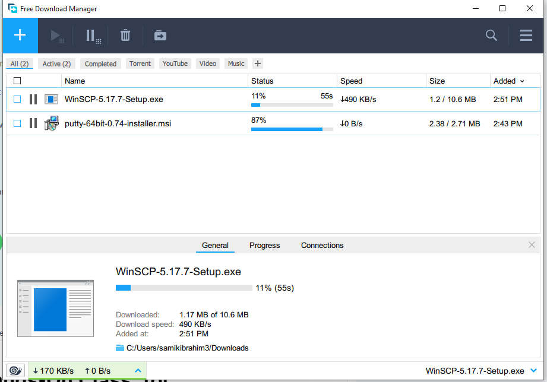
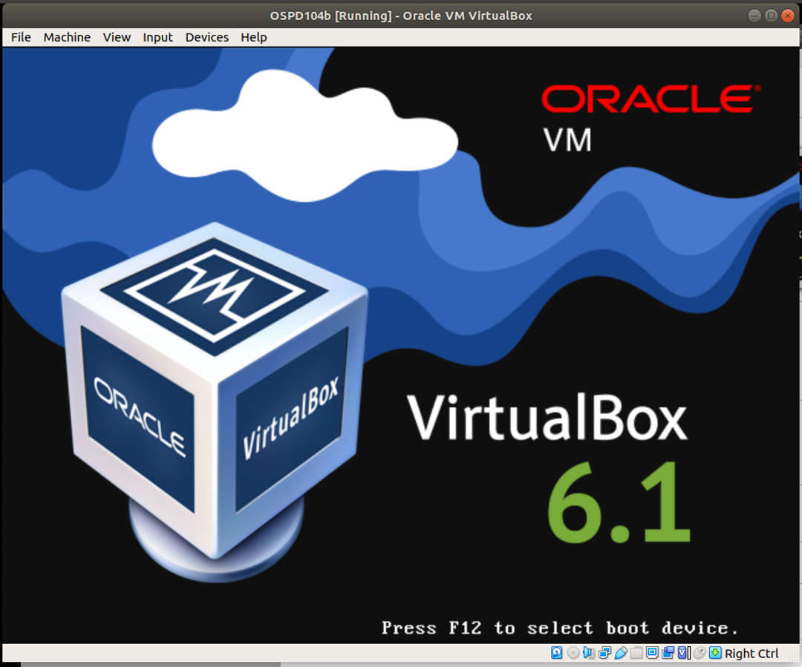
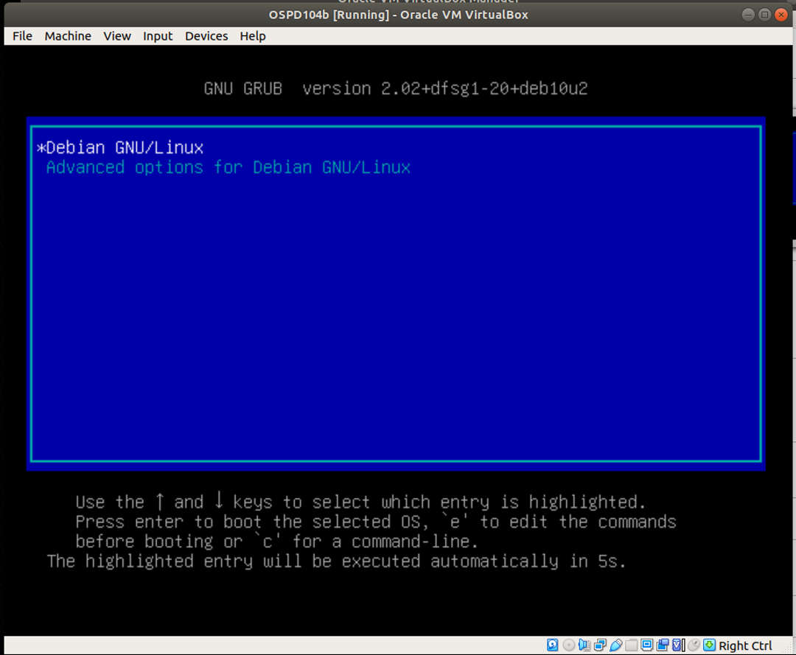
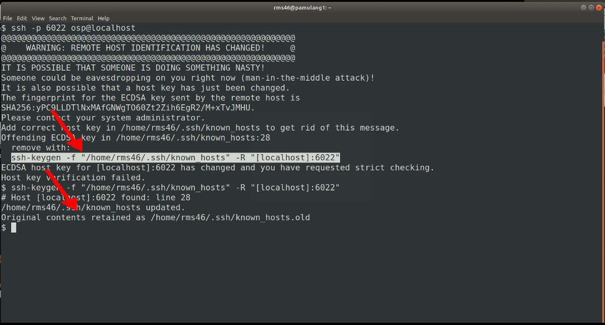
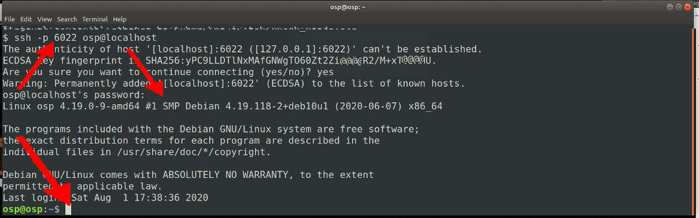

---
---

[HOME](index.md)
[ABOUT](README.md)
[WEB](https://osp4diss.vlsm.org/)
[GITHUB](https://github.com/UI-FASILKOM-OS/osp4diss/)
[TOP](#)
[BOTTOM](#endofpage)
[PREV](ExportImportGuests.md)
[NEXT](UpdateDebian.md)

# PUTTY, WINSCP and SSH

<br>
## Free Download Manager

<span style="color:red; font-weight:bold; font-size:larger;">
Use Free Download Manager if your internet link is slow and less reliable.
Otherwise, download with a regular browser like Firefox or you can install the <b>plugin</b> for that brower.
</span>

### FDM URL: [https://www.freedownloadmanager.org/](https://www.freedownloadmanager.org/)

<br>
## Downloading PUTTY

### PUTTY URL: [https://www.chiark.greenend.org.uk/~sgtatham/putty/latest.html](https://www.chiark.greenend.org.uk/~sgtatham/putty/latest.html)

* In this example, the version is <span style="color:red; font-weight:bold; font-size:larger;">PUTTY 0.74</span>


* Free Download Manager


<br>
## Downloading WINSCP

### WinSCP URL: [https://winscp.net/eng/download.php](https://winscp.net/eng/download.php)

* In this example, the version is <span style="color:red; font-weight:bold; font-size:larger;">WinSCP 5.17</span>


* Free Download Manager


* ZZZ... waiting...




<hr>






<br>
## SSH (or putty) from HOST

```
ssh -p 6022 osp@localhost
# REMOVE THE OLD KEY
ssh-keygen -f ~/.ssh/known_hosts -R "[localhost]:6022"
```



```
# ONE MORE TIME
ssh -p 6022 osp@localhost
```



<br>
#### ENDOFPAGE
[HOME](index.md)
[ABOUT](README.md)
[WEB](https://osp4diss.vlsm.org/)
[GITHUB](https://github.com/UI-FASILKOM-OS/osp4diss/)
[TOP](#)
[BOTTOM](#endofpage)
[PREV](ExportImportGuests.md)
[NEXT](UpdateDebian.md)
<br>

