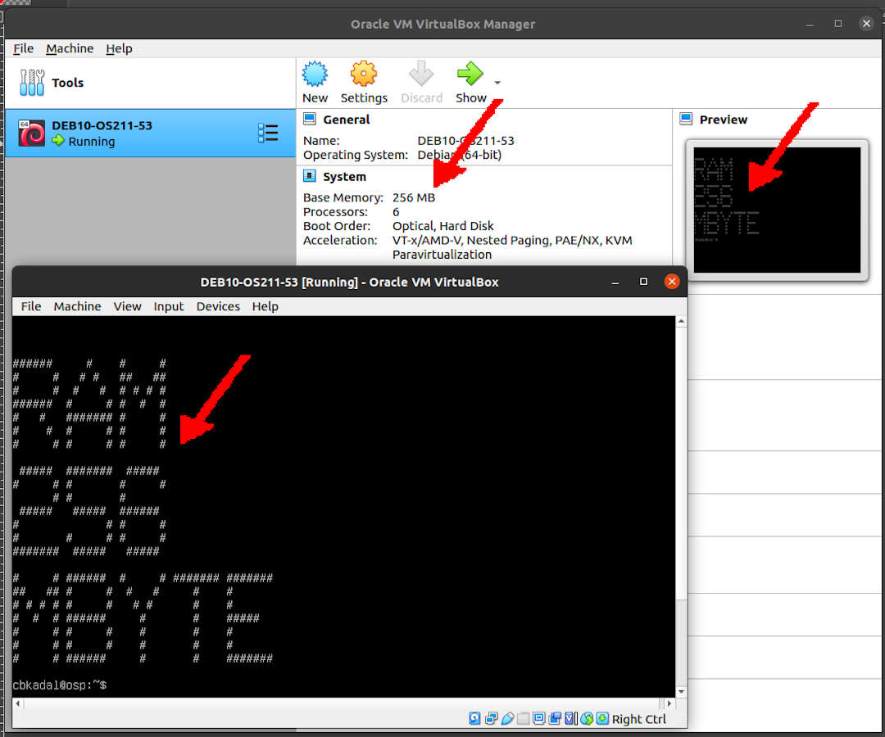

---
---

[HOME](index.md)
[ABOUT](README.md)
[WEB](https://osp4diss.vlsm.org/)
[GITHUB](https://github.com/UI-FASILKOM-OS/osp4diss/)
[TOP](#)
[BOTTOM](#endofpage)
[PREV](W04.md)
[NEXT](W06.md)

<br>
## Assignment WEEK 05 (eg. cbkadal) 

### Read [OSC-10](https://www.os-book.com/OS10/) Chapter 10 [slides](https://www.os-book.com/OS10/slide-dir/).

<br>
### Visit <https://os.vlsm.org/GitHubPages/>
* Review Last WEEK TOP 10 List and pick at least 3 out of your 10 next neighbors of WEEK04.
* Eg. **review** [cbkadal WEEK04](https://cbkadal.github.io/os211/W04/)

<br>
### Create your TOP 10 List of WEEK 05
* Eg. <https://cbkadal.github.io/os211/W05/>.
* Do not use lecture material.
* Please be more creative!

<br>
### Do Demo WEEK 05
* [WEEK 05: Virtual Memory](https://github.com/UI-FASILKOM-OS/SistemOperasi/tree/master/Demos/Week05).
* Set the following **TOP DISPLAY**.

```
PID, VIRT, RES, SHR, SWAP, CODE, DATA, USED, nDRT.
```
* Check **THE TOP DISPLAY** by running "top":

```
top - 08:03:34 up  1:22,  2 users,  load average: 0.08, 0.02, 0.00
Tasks: 110 total,   1 running, 109 sleeping,   0 stopped,   0 zombie
%Cpu0  :  0.0 us,  0.0 sy,  0.0 ni,100.0 id,  0.0 wa,  0.0 hi,  0.0 si,  0.0 st
%Cpu1  :  0.0 us,  0.0 sy,  0.0 ni,100.0 id,  0.0 wa,  0.0 hi,  0.0 si,  0.0 st
%Cpu2  :  0.0 us,  0.0 sy,  0.0 ni,100.0 id,  0.0 wa,  0.0 hi,  0.0 si,  0.0 st
%Cpu3  :  0.0 us,  0.0 sy,  0.0 ni,100.0 id,  0.0 wa,  0.0 hi,  0.0 si,  0.0 st
%Cpu4  :  0.0 us,  0.2 sy,  0.0 ni, 99.6 id,  0.0 wa,  0.0 hi,  0.2 si,  0.0 st
%Cpu5  :  0.0 us,  0.2 sy,  0.0 ni, 99.8 id,  0.0 wa,  0.0 hi,  0.0 si,  0.0 st
MiB Mem :    986.5 total,    299.5 free,    163.9 used,    523.1 buff/cache
MiB Swap:    488.0 total,    488.0 free,      0.0 used.    657.5 avail Mem 

  PID    VIRT    RES    SHR   SWAP   CODE    DATA   USED nDRT 
  429 1665196  80600  42576      0  45728  271500  80600    0 
  645   16992   5668   4344      0    496    1280   5668    0 
   13       0      0      0      0      0       0      0    0 
  466 1468968  34216  21624      0  19672  254340  34216    0 
 1976   11032   3468   2900      0    108    1188   3468    0 
    1   21928  10088   7924      0    892    1672  10088    0 

```
* [See also the TOP tutorial](osp-101.md).

<br>
### Download <https://os.vlsm.org/WEEK/WEEK05.tar.bz2.asc>.

#### INPUT-01

```
ls -al
wget -c https://os.vlsm.org/WEEK/WEEK05.tar.bz2.asc
ls -al

```

#### OUTPUT-01

```
cbkadal@osp:~/mydemo/work$ ls -al
total 8
drwxr-xr-x 2 cbkadal cbkadal 4096 Mar 27 07:38 .
drwxr-xr-x 4 cbkadal cbkadal 4096 Mar 27 07:41 ..

cbkadal@osp:~/mydemo/work$ wget -c https://os.vlsm.org/WEEK/WEEK05.tar.bz2.asc
--2021-03-27 08:10:41--  https://os.vlsm.org/WEEK/WEEK05.tar.bz2.asc
Resolving os.vlsm.org (os.vlsm.org)... 185.199.108.153, 185.199.110.153, 185.199.109.153, ...
Connecting to os.vlsm.org (os.vlsm.org)|185.199.108.153|:443... connected.
HTTP request sent, awaiting response... 200 OK
Length: 1873158 (1.8M) [application/pgp-signature]
Saving to: ‘WEEK05.tar.bz2.asc’

WEEK05.tar.bz2.asc     100%[====================================>]   1.79M  1.79MB/s    in 1.0s    

2021-03-27 08:10:44 (1.79 MB/s) - ‘WEEK05.tar.bz2.asc’ saved [1873158/1873158]

cbkadal@osp:~/mydemo/work$ ls -al
total 1840
drwxr-xr-x 2 cbkadal cbkadal    4096 Mar 27 08:10 .
drwxr-xr-x 4 cbkadal cbkadal    4096 Mar 27 07:41 ..
-rw-r--r-- 1 cbkadal cbkadal 1873158 Mar 27 07:28 WEEK05.tar.bz2.asc
cbkadal@osp:~/mydemo/work$ 

```

* Decrypt "WEEK05.tar.bz2.asc" into tarball file "WEEK05.tar.bz2"
* The "passphrase" will be announced on Zoom session. 

#### INPUT-02

```
ls -al
gpg -o WEEK05.tar.bz2 -d WEEK05.tar.bz2.asc

```

#### OUTPUT-02

```
cbkadal@osp:~/mydemo/work$ ls -al
total 1840
drwxr-xr-x 2 cbkadal cbkadal    4096 Mar 27 08:10 .
drwxr-xr-x 4 cbkadal cbkadal    4096 Mar 27 07:41 ..
-rw-r--r-- 1 cbkadal cbkadal 1873158 Mar 27 07:28 WEEK05.tar.bz2.asc

cbkadal@osp:~/mydemo/work$ gpg -o WEEK05.tar.bz2 -d WEEK05.tar.bz2.asc

```


```
gpg: AES256 encrypted data
gpg: encrypted with 1 passphrase

cbkadal@osp:~/mydemo/work$

```

### Extract tarball "WEEK05.tar.bz2"
* Enter folder "WEEK05/"

#### INPUT-03

````
ls -al
tar xf WEEK05.tar.bz2
ls -al
cd WEEK05/
ls -al

````


#### OUTPUT-03

```
cbkadal@osp:~/mydemo/work$ ls -al
total 3192
drwxr-xr-x 2 cbkadal cbkadal    4096 Mar 27 08:16 .
drwxr-xr-x 4 cbkadal cbkadal    4096 Mar 27 07:41 ..
-rw-r--r-- 1 cbkadal cbkadal 1383121 Mar 27 08:16 WEEK05.tar.bz2
-rw-r--r-- 1 cbkadal cbkadal 1873158 Mar 27 07:28 WEEK05.tar.bz2.asc

cbkadal@osp:~/mydemo/work$ tar xf WEEK05.tar.bz2

cbkadal@osp:~/mydemo/work$ ls -al
total 3196
drwxr-xr-x 3 cbkadal cbkadal    4096 Mar 27 08:29 .
drwxr-xr-x 4 cbkadal cbkadal    4096 Mar 27 07:41 ..
drwxr-xr-x 3 cbkadal cbkadal    4096 Mar 27 07:07 WEEK05
-rw-r--r-- 1 cbkadal cbkadal 1383121 Mar 27 08:16 WEEK05.tar.bz2
-rw-r--r-- 1 cbkadal cbkadal 1873158 Mar 27 07:28 WEEK05.tar.bz2.asc

cbkadal@osp:~/mydemo/work$ cd WEEK05/

cbkadal@osp:~/mydemo/work/WEEK05$ ls -al
total 16
drwxr-xr-x 3 cbkadal cbkadal 4096 Mar 27 07:07 .
drwxr-xr-x 3 cbkadal cbkadal 4096 Mar 27 08:29 ..
-rw-r--r-- 1 cbkadal cbkadal    0 Mar 27 07:07 000-STOP-SET-TOP-FIRST.txt
-rw-r--r-- 1 cbkadal cbkadal 1036 Mar 27 07:07 001-README.txt
drwxr-xr-x 2 cbkadal cbkadal 4096 Mar 27 07:07 DEMO05

cbkadal@osp:~/mydemo/work/WEEK05$

```

<br>
## Make sure that *TOP* display is set!

## Follow the "001-README.txt" file.

#### INPUT-04

```
cd WEEK05/
ls -al
bash 001-README.txt
ls -al
cd ..
ls -al

```

#### OUTPUT-04

```
cbkadal@osp:~/mydemo/work$ cd WEEK05/

cbkadal@osp:~/mydemo/work/WEEK05$ ls -al
total 16
drwxr-xr-x 3 cbkadal cbkadal 4096 Mar 27 07:07 .
drwxr-xr-x 3 cbkadal cbkadal 4096 Mar 27 08:29 ..
-rw-r--r-- 1 cbkadal cbkadal    0 Mar 27 07:07 000-STOP-SET-TOP-FIRST.txt
-rw-r--r-- 1 cbkadal cbkadal 1036 Mar 27 07:07 001-README.txt
drwxr-xr-x 2 cbkadal cbkadal 4096 Mar 27 07:07 DEMO05

cbkadal@osp:~/mydemo/work/WEEK05$ bash 001-README.txt
STOP-SET-TOP-FIRST
See https://osp4diss.vlsm.org/osp-101.html
clean all
rm -f 12-memory 
rm -f *.map
compile all
gcc -std=gnu99 12-memory.c 13-chktoken.c -o 12-memory -Xlinker  \
	-Map=12-memory.map -lcrypto
clean all
rm -f 12-memory 
rm -f *.map
READ WEEK05-DEMO05.txt

cbkadal@osp:~/mydemo/work/WEEK05$ ls -al
total 16
drwxr-xr-x 3 cbkadal cbkadal 4096 Mar 27 07:07 .
drwxr-xr-x 3 cbkadal cbkadal 4096 Mar 27 08:47 ..
-rw-r--r-- 1 cbkadal cbkadal    0 Mar 27 07:07 000-STOP-SET-TOP-FIRST.txt
-rw-r--r-- 1 cbkadal cbkadal 1036 Mar 27 07:07 001-README.txt
drwxr-xr-x 2 cbkadal cbkadal 4096 Mar 27 08:47 DEMO05

cbkadal@osp:~/mydemo/work/WEEK05$ cd ..

cbkadal@osp:~/mydemo/work$ ls -al
total 3200
drwxr-xr-x 3 cbkadal cbkadal    4096 Mar 27 08:47 .
drwxr-xr-x 4 cbkadal cbkadal    4096 Mar 27 07:41 ..
drwxr-xr-x 3 cbkadal cbkadal    4096 Mar 27 07:07 WEEK05
-rw-r--r-- 1 cbkadal cbkadal    3407 Mar 27 08:47 WEEK05-DEMO05.txt
-rw-r--r-- 1 cbkadal cbkadal 1383121 Mar 27 08:16 WEEK05.tar.bz2
-rw-r--r-- 1 cbkadal cbkadal 1873158 Mar 27 07:28 WEEK05.tar.bz2.asc

cbkadal@osp:~/mydemo/work$

```

* The result should be inside "WEEK05-DEMO05.txt"
* Check file "WEEK05-DEMO05.txt"
* VerifyToken

#### INPUT-05

```
ls -al
cat WEEK05-DEMO05.txt
verifyToken OS211W05 cbkadal 4705-4439

```

#### OUTPUT-05

```
cbkadal@osp:~/mydemo/work$ ls -al
total 3200
drwxr-xr-x 3 cbkadal cbkadal    4096 Mar 27 08:47 .
drwxr-xr-x 4 cbkadal cbkadal    4096 Mar 27 07:41 ..
drwxr-xr-x 3 cbkadal cbkadal    4096 Mar 27 07:07 WEEK05
-rw-r--r-- 1 cbkadal cbkadal    3407 Mar 27 08:47 WEEK05-DEMO05.txt
-rw-r--r-- 1 cbkadal cbkadal 1383121 Mar 27 08:16 WEEK05.tar.bz2
-rw-r--r-- 1 cbkadal cbkadal 1873158 Mar 27 07:28 WEEK05.tar.bz2.asc

cbkadal@osp:~/mydemo/work$ cat WEEK05-DEMO05.txt
pwd

/home/cbkadal/mydemo/work/WEEK05/DEMO05
date
Sat 27 Mar 08:47:05 WIB 2021
12-memory
xxxxxxxxxxxxxxxxxxxxxxxxxxxxxxxxxxxxxxxxxxxxxxxxxxxxxxxxxxxxxxxxxxxxxxxxxxx
ZCZC verifyToken OS211W05 cbkadal 4705-4439
xxxxxxxxxxxxxxxxxxxxxxxxxxxxxxxxxxxxxxxxxxxxxxxxxxxxxxxxxxxxxxxxxxxxxxxxxxx
MiB Mem :    986.5 total,    269.2 free,    165.1 used,    552.2 buff/cache
MiB Swap:    488.0 total,    488.0 free,      0.0 used.    656.0 avail Mem 

  PID    VIRT    RES    SHR   SWAP   CODE    DATA   USED nDRT
 2144    5416   1528   1240      0      8     364   1528    0
PART 1
xxxxxxxxxxxxxxxxxxxxxxxxxxxxxxxxxxxxxxxxxxxxxxxxxxxxxxxxxxxxxxxxxxxxxxxxxxx
 2144    5416   1528   1240      0      8     364   1528    0 [10000]

== TL;DR ==

-rw-r--r-- 1 cbkadal cbkadal   1811 Mar 27 07:07 13-chktoken.c
-rw-r--r-- 1 cbkadal cbkadal    428 Mar 27 07:07 Makefile
-rw-r--r-- 1 cbkadal cbkadal   2156 Mar 27 08:47 WEEK05-DEMO05.txt
pwd
/home/cbkadal/mydemo/work/WEEK05/DEMO05
date
Sat 27 Mar 08:47:10 WIB 2021
mv WEEK05-DEMO05.txt ../../

cbkadal@osp:~/mydemo/work$ verifyToken OS211W05 cbkadal 4705-4439
Verified

cbkadal@osp:~/mydemo/work$

```

<br>
### Create a new "$HOME/RESULT/W05/" directory
* this directory **should not be** inside your git repositories.
* move file "WEEK05-DEMO05.txt" into the "W05/" directory.

#### INPUT-06

```
rm -rf   $HOME/RESULT/W05/ $HOME/RESULT/myW05.tar.bz2
ls -al . $HOME/RESULT/
mkdir -p $HOME/RESULT/W05/
mv       WEEK05-DEMO05.txt $HOME/RESULT/W05/
ls -al   $HOME/RESULT/     $HOME/RESULT/W05/

```

#### OUTPUT-06

```
cbkadal@osp:~/mydemo/work$ rm -rf   $HOME/RESULT/W05/ $HOME/RESULT/myW05.tar.bz2

cbkadal@osp:~/mydemo/work$ ls -al . $HOME/RESULT/
.:
total 3200
drwxr-xr-x 3 cbkadal cbkadal    4096 Mar 27 09:03 .
drwxr-xr-x 4 cbkadal cbkadal    4096 Mar 27 07:41 ..
drwxr-xr-x 3 cbkadal cbkadal    4096 Mar 27 07:07 WEEK05
-rw-r--r-- 1 cbkadal cbkadal    3407 Mar 27 09:03 WEEK05-DEMO05.txt
-rw-r--r-- 1 cbkadal cbkadal 1383121 Mar 27 08:16 WEEK05.tar.bz2
-rw-r--r-- 1 cbkadal cbkadal 1873158 Mar 27 07:28 WEEK05.tar.bz2.asc

/home/cbkadal/RESULT/:
total 28
drwxr-xr-x  4 cbkadal cbkadal 4096 Mar 27 09:04 .
drwx--x--x 18 cbkadal cbkadal 4096 Mar 27 07:31 ..
-rw-r--r--  1 cbkadal cbkadal 1458 Mar 27 00:12 myW03.tar.bz2
-rw-r--r--  1 cbkadal cbkadal 7483 Mar 27 00:12 myW04.tar.bz2
drwxr-xr-x  2 cbkadal cbkadal 4096 Mar 12 21:15 W03
drwxr-xr-x  2 cbkadal cbkadal 4096 Mar 23 09:18 W04

cbkadal@osp:~/mydemo/work$ mkdir -p $HOME/RESULT/W05/

cbkadal@osp:~/mydemo/work$ mv       WEEK05-DEMO05.txt $HOME/RESULT/W05/

cbkadal@osp:~/mydemo/work$ ls -al   $HOME/RESULT/     $HOME/RESULT/W05/
/home/cbkadal/RESULT/:
total 32
drwxr-xr-x  5 cbkadal cbkadal 4096 Mar 27 09:04 .
drwx--x--x 18 cbkadal cbkadal 4096 Mar 27 07:31 ..
-rw-r--r--  1 cbkadal cbkadal 1458 Mar 27 00:12 myW03.tar.bz2
-rw-r--r--  1 cbkadal cbkadal 7483 Mar 27 00:12 myW04.tar.bz2
drwxr-xr-x  2 cbkadal cbkadal 4096 Mar 12 21:15 W03
drwxr-xr-x  2 cbkadal cbkadal 4096 Mar 23 09:18 W04
drwxr-xr-x  2 cbkadal cbkadal 4096 Mar 27 09:04 W05

/home/cbkadal/RESULT/W05/:
total 12
drwxr-xr-x 2 cbkadal cbkadal 4096 Mar 27 09:04 .
drwxr-xr-x 5 cbkadal cbkadal 4096 Mar 27 09:04 ..
-rw-r--r-- 1 cbkadal cbkadal 3407 Mar 27 09:03 WEEK05-DEMO05.txt

cbkadal@osp:~/mydemo/work$

```

<br>
## How Low Can You Go?

* Shutdown your Debian Guest.
* (SET) Lower the RAM size of your Debian Guest.
* Boot your Debian Guest again.
  * How much (minimum) RAM is needed to boot your Debian Guest?
    * 512 MB?
    * 256 MB?
    * Less?
  * Try it until your Guest can not boot.
* Make a JPG screenshot of the smallest possible RAM size.
  * Show that you can login to the system from the VirtualBox console.
  * The screen size should be about 1080x900 with about 60% quality.
  * Filename: WEEK05-yourAccount-RAM_Size-MB.jpg
    * Eg.  "WEEK05-cbkadal-256MB.jpg"
* Shutdown, reset the Virtual Guest RAM Size back to normal, and reboot.
* Put the screenshot file into the "$HOME/RESULT/W05/" folder too.



#### INPUT-07

```
cd $HOME/RESULT/W05/
ls -al

```

#### OUTPUT-07

```
cbkadal@osp:~$ cd $HOME/RESULT/W05/

cbkadal@osp:~/RESULT/W05$ ls -al
total 112
drwxr-xr-x 2 cbkadal cbkadal  4096 Mar 29 18:29 .
drwxr-xr-x 5 cbkadal cbkadal  4096 Mar 27 09:06 ..
-rw-r--r-- 1 cbkadal cbkadal 98660 Mar 29 18:27 WEEK05-cbkadal-256MB.jpg
-rw-r--r-- 1 cbkadal cbkadal  3407 Mar 27 09:03 WEEK05-DEMO05.txt

cbkadal@osp:~/RESULT/W05$ 

```


<br>
### Update "TXT/myscript.sh"
* Modify "myscript.sh" to automate the tarball encryption process. 
* See also <https://cbkadal.github.io/os211/004.html>.
* tar and compress the "W04/" directory into "myW04.tar.bz2"
  * See also [How to create a TARBALL(osp-001.md).
* gnupg asymetric encryption and armor TARBALL "myW04.tar.bz2" for "operatingsystems@vlsm.org" and "yourself".
* the result "myW04.tar.bz2.asc" should be placed into the "TXT/" folder.


#### INPUT-08

```
cd $HOME/git/os211/TXT/
ls -al
bash myscript.sh
ls -al

```

#### OUTPUT-08

```
cbkadal@osp:~$ cd $HOME/git/os211/TXT/

cbkadal@osp:~/git/os211/TXT$ ls -al
total 48
drwxr-xr-x 2 cbkadal cbkadal  4096 Mar 29 18:36 .
drwxr-xr-x 9 cbkadal cbkadal  4096 Mar 27 09:11 ..
-rw-r--r-- 1 cbkadal cbkadal  1171 Mar 11 14:28 mylog.txt
-rw-r--r-- 1 cbkadal cbkadal  3147 Mar 11 14:28 mypubkey.txt
-rw-r--r-- 1 cbkadal cbkadal   491 Mar 11 14:28 myrank.txt
-rw-r--r-- 1 cbkadal cbkadal  1590 Mar 27 00:12 myscript.sh
-rw-r--r-- 1 cbkadal cbkadal  3555 Mar 29 18:33 myW03.tar.bz2.asc
-rw-r--r-- 1 cbkadal cbkadal 11713 Mar 29 18:33 myW04.tar.bz2.asc
-rw-r--r-- 1 cbkadal cbkadal   562 Mar 29 18:33 SHA256SUM
-rw-r--r-- 1 cbkadal cbkadal   833 Mar 29 18:33 SHA256SUM.asc

cbkadal@osp:~/git/os211/TXT$ bash myscript.sh

~/RESULT ~/git/os211/TXT

tar cfj myW03.tar.bz2 W03/
gpg --armor --output myW03.tar.bz2.asc --encrypt --recipient operatingsystems@vlsm.org --recipient cbk@dummy myW03.tar.bz2

tar cfj myW04.tar.bz2 W04/
gpg --armor --output myW04.tar.bz2.asc --encrypt --recipient operatingsystems@vlsm.org --recipient cbk@dummy myW04.tar.bz2

tar cfj myW05.tar.bz2 W05/
gpg --armor --output myW05.tar.bz2.asc --encrypt --recipient operatingsystems@vlsm.org --recipient cbk@dummy myW05.tar.bz2

~/git/os211/TXT

Check and move /home/cbkadal/RESULT/myW03.tar.bz2.asc...
Check and move /home/cbkadal/RESULT/myW04.tar.bz2.asc...
Check and move /home/cbkadal/RESULT/myW05.tar.bz2.asc...

rm -f SHA256SUM SHA256SUM.asc

sha256sum my*.asc my*.txt my*.sh > SHA256SUM

sha256sum -c SHA256SUM
myW03.tar.bz2.asc: OK
myW04.tar.bz2.asc: OK
myW05.tar.bz2.asc: OK
mylog.txt: OK
mypubkey.txt: OK
myrank.txt: OK
myscript.sh: OK

gpg -o SHA256SUM.asc -a -sb SHA256SUM
gpg --verify SHA256SUM.asc SHA256SUM
gpg: Signature made Mon 29 Mar 2021 18:36:40 WIB
gpg:                using RSA key 56754A8214D01B20B97BF5EF078CA2C2F3F22F37
gpg: Good signature from "Cicak Bin Kadal (CBK) <cbk@dummy>" [ultimate]

cbkadal@osp:~/git/os211/TXT$ ls -al
total 156
drwxr-xr-x 2 cbkadal cbkadal   4096 Mar 29 18:36 .
drwxr-xr-x 9 cbkadal cbkadal   4096 Mar 27 09:11 ..
-rw-r--r-- 1 cbkadal cbkadal   1171 Mar 11 14:28 mylog.txt
-rw-r--r-- 1 cbkadal cbkadal   3147 Mar 11 14:28 mypubkey.txt
-rw-r--r-- 1 cbkadal cbkadal    491 Mar 11 14:28 myrank.txt
-rw-r--r-- 1 cbkadal cbkadal   1590 Mar 27 00:12 myscript.sh
-rw-r--r-- 1 cbkadal cbkadal   3555 Mar 29 18:36 myW03.tar.bz2.asc
-rw-r--r-- 1 cbkadal cbkadal  11713 Mar 29 18:36 myW04.tar.bz2.asc
-rw-r--r-- 1 cbkadal cbkadal 109574 Mar 29 18:36 myW05.tar.bz2.asc
-rw-r--r-- 1 cbkadal cbkadal    562 Mar 29 18:36 SHA256SUM
-rw-r--r-- 1 cbkadal cbkadal    833 Mar 29 18:36 SHA256SUM.asc

cbkadal@osp:~/git/os211/TXT$ 

```

<br>
## Do the "4 git mantra": pull, add, commit, push.

### INPUT-09
```
git pull; git add -A; git commit -m "OS211 cbkadal"; git push;

```

### OUTPUT-09
```
cbkadal@osp:~/git/os211/TXT$ git pull; git add -A; git commit -m "OS211 cbkadal"; git push;
Already up to date.
[master 5ad4657] OS211 cbkadal
 5 files changed, 309 insertions(+), 309 deletions(-)
 rewrite TXT/SHA256SUM.asc (91%)
 rewrite TXT/myW03.tar.bz2.asc (96%)
 rewrite TXT/myW04.tar.bz2.asc (98%)
 rewrite TXT/myW05.tar.bz2.asc (96%)
Enumerating objects: 15, done.
Counting objects: 100% (15/15), done.
Delta compression using up to 6 threads
Compressing objects: 100% (8/8), done.
Writing objects: 100% (8/8), 14.92 KiB | 4.97 MiB/s, done.
Total 8 (delta 2), reused 0 (delta 0)
remote: Resolving deltas: 100% (2/2), completed with 2 local objects.
To github.com:cbkadal/os211.git
   4d3822f..5ad4657  master -> master
cbkadal@osp:~/git/os211/TXT$ 

```

<br>
## Update your log
* Eg. <https://cbkadal.github.io/os211/TXT/mylog.txt>.

<br>
## CHECK LIST

```
HOMEPAGE: links to W01/, W02/, W03/, W04/, W05/
Top10 Files: w01.md, w02.md, w03.md, w04.md, wd05
TXT/mypubkey.txt: Public Key
TXT/myrank.txt: Top10 review up to Week04.
TXT/myscript.sh: A script to automate the process
TARBALLS: myW03.tar.bz2.asc, myW04.tar.bz2.asc, myW05.tar.bz2.asc (assignments)
TXT/mylog.txt: Log Update
Checksum: SHA256SUM 
Signature: SHA256SUM.asc

```

<br>
#### ENDOFPAGE
[HOME](index.md)
[ABOUT](README.md)
[WEB](https://osp4diss.vlsm.org/)
[GITHUB](https://github.com/UI-FASILKOM-OS/osp4diss/)
[TOP](#)
[BOTTOM](#endofpage)
[PREV](W04.md)
[NEXT](W06.md)
<br>

