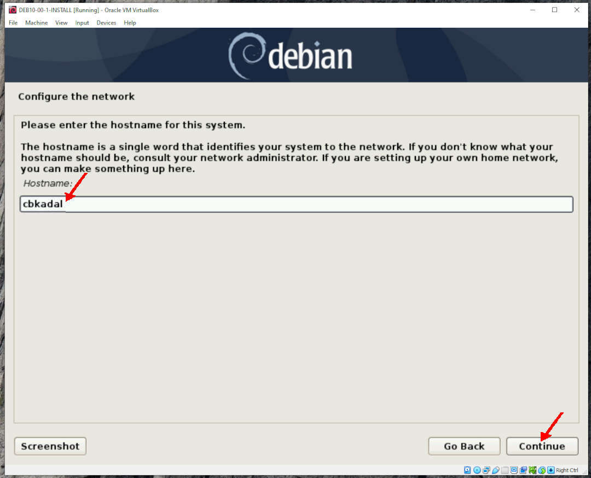
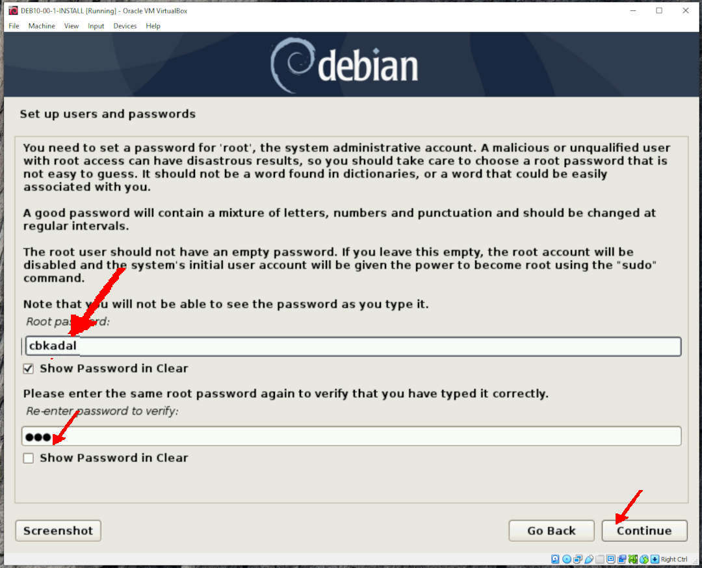

---
---

[HOME](index.md)
[ABOUT](README.md)
[WEB](https://osp4diss.vlsm.org/)
[GITHUB](https://github.com/UI-FASILKOM-OS/osp4diss/)
[TOP](#)
[BOTTOM](#endofpage)
[PREV](InstallVirtualBox.md)
[NEXT](DebianGuestExportOva.md)

# Creating a Debian Guest on VirtualBox

## NOTE: Version Debian 10.7

## THIS IS SUBJECT TO CHANGE!

 
[Part 1: Creating a New Guest](#part-1-creating-a-new-guest)
 
[Part 2: Setting the New Guest](#part-2-setting-the-new-guest-in-this-example-deb10-00-0-64g64g-empty)

## Part 1: Creating a New Guest

* You should adjust these following according to your own belief and faith.
  * Name: **DEB10-00-0-64G+64G-EMPTY** (your version may be different).
  * Memory = 1024 MB (512MB is OK too!)
  * Storage1 = 64 GB (dynamically allocated)
  * Storage2 = 64 GB (dynamically allocated)
  * SSH: NAT  from host  (127.0.0.1 port 6022) to guest (10.0.2.15 port 22)
  * Jekyll: NAT from host (127.0.0.1 port 5000) to guest (10.0.2.15 port 4000)

 
## Click NEW

 
* Name = **DEB10-00-0-64G+64G-EMPTY**
  * Type: Linux
  * Version: Debian (64bit)

 
* Memory size = 1024 MB (But, 512 MB is OK too!)

 
* Create a Virtual Hard Disk

 
* Hard Disk type: VDI

 
* Storage: Dynamically Allocated

 
* Storage = 64 GB (dynamically allocated)

 
## Part 2: Setting the New Guest (In this example **DEB10-00-0-64G+64G-EMPTY**)

### Click SETTING

 
### General: Basic

 
### General: Advanced

 
### System: Motherboard

 
### System: Processors (6)

 
### System: Acceleration

 
### Display: Screen

* Scale Factor: 150%

 
### Storage: Remove Empty IDE

* RIGHT click (Remove Attachment)

* Remove Empty 

 
### Storage: SATA: Adds Hard disk

* Create a new disk

* Hard disk type: VDI

* Dynamically Allocated

* (Second) Disk Storage: 64 GB

* Choose (64 GB Storage)

* Sellect IDE Controller

* Remove IDE Controller

 
### Audio

* (Nothing)

 
### Network: Adapter 1 (NAT): Port Forwarding

* Click Advanced

* **ADD (+)** Forward ssh from host 127.0.0.1:6022 to guest 10.0.2.15:22

 
### Network: Adapter 1 (NAT)

 
## OSP105 is DONE!

 
# The SHORTCUT

For a limited time only!
If you are rushing, you might want to download this following OVA file.
No purchase necessary and void where prohibited.
Hurry, Google might not like it if too many downloads a huge file. 

* **README1**:  [https://bit.ly/3mxkpvP](https://bit.ly/3mxkpvP) (182 bytes)

* **Debian 10.5 OVA for VirtualBox**: [https://bit.ly/2FMU7F8](https://bit.ly/2FMU7F8) (662MB)

* **README2**: [https://bit.ly/30ysAP5](https://bit.ly/30ysAP5) (249 bytes)

* **Ubuntu Server 20.04 for VirtualBox**: [https://bit.ly/2HRIihL](https://bit.ly/2HRIihL) (1.2GB)

 
#### ENDOFPAGE
[HOME](index.md)
[ABOUT](README.md)
[WEB](https://osp4diss.vlsm.org/)
[GITHUB](https://github.com/UI-FASILKOM-OS/osp4diss/)
[TOP](#)
[BOTTOM](#endofpage)
[PREV](InstallVirtualBox.md)
[NEXT](DebianGuestExportOva.md)
 

---
---

[HOME](index.md)
[ABOUT](README.md)
[WEB](https://osp4diss.vlsm.org/)
[GITHUB](https://github.com/UI-FASILKOM-OS/osp4diss/)
[TOP](#)
[BOTTOM](#endofpage)
[PREV](index.md)
[NEXT](index.md)

RED

 
### Storage: SATA: Add Debian NetInst ISO image (Eg. debian-10.5.0-amd64-netinst.iso)

# XXXX

 

 

 

 

 

 

 

 

 

 

 

 

 

 

 

 

 

 

 

 

 

 

 

 

 

 

 

 

 

 

 

 

 

 

 

 

 

 

 

 

 

 

 

 

 

 

 

 

 

 

 

 

 

 

 

 

 

 

 

 

 

 

 

 

 

 

 

 

 

 

 

 

 

 

 

 

 

 

 

 

 

 

 

 

 

 

 

 

 

 

 

 

 

 

 

 

 

 

 

 

 

 

 

 

 

 

 

 

 

 

 

 

 

 

 

 

 
#### ENDOFPAGE
[HOME](index.md)
[ABOUT](README.md)
[WEB](https://osp4diss.vlsm.org/)
[GITHUB](https://github.com/OSP4DISS/osp4diss/)
[TOP](#)
[PREV](index.md)
[NEXT](index.md)
[BOTTOM](#endofpage)
 

